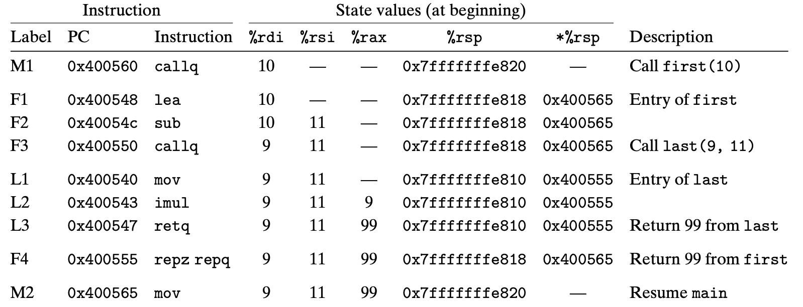

# Practice Problem 3.32

The disassembled code for two functions ```first``` and ```last``` is shown below, along with the code for a call of ```first``` by function ```main```:

```assembly
Disassembly of last(long u, long v)
 u in %rdi, v in %rsi
 0000000000400540 <last>:
 400540:  48 89 f8         mov  %rdi, %rax        L1: u
 400543:  48 0f af c6.     imul %rsi, %rax        L2: u*v
 400547:  c3               retq                   L3: Return
 
Disassembly of last(long x)
 x in %rdi
0000000000400548 <first>:
400548:  48 8d 77 01      lea 0x1(%rdi), %rsi     F1: x+1
40054c:  48 83 ef 01      sub $0x1, %rdi          F2: x-1
400550:  e8 eb ff ff ff   callq  400540 <last>    F3: Call last(x-1,x+1)
400555:  f3 c3            repz retq               F4: Return
.
.
.
400560:  e8 e3 ff ff ff  callq 400548 <first>    M1: Call first(10)
400565:  48 89 c2        mov %rax, %rdx.         M2: Resume
```

Each of these instructions is given a label. Starting with the calling of ```first(10)``` by main, fill in the following table to trace instruction execution through to the point where the program returns back to ```main```.

```
Instruction State values (at beginning)
Label PC Instruction %rdi %rsi %rax %rsp *%rsp M1 0x400560 callq 10 — — 0x7fffffffe820 —
F1
F2 F3
L1 L2 L3
F4 M2
```

***

