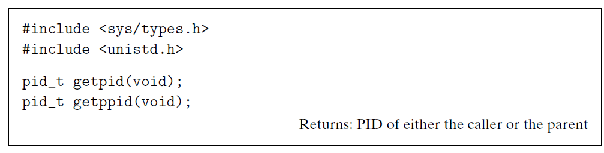

# Ch8 Exceptional Control Flow

## 8.3 System Call Error Handling

unix 系统函数发生错误时，函数会返回 -1，并设置全局整数变量 errno 来表示具体错误。可通过 `strerror` 函数来查看 errno 所关联的具体错误。

## 8.4 Process Control

### 8.4.1 Obtaining Process IDs

获取进程 pid 和 父进程 pid：

