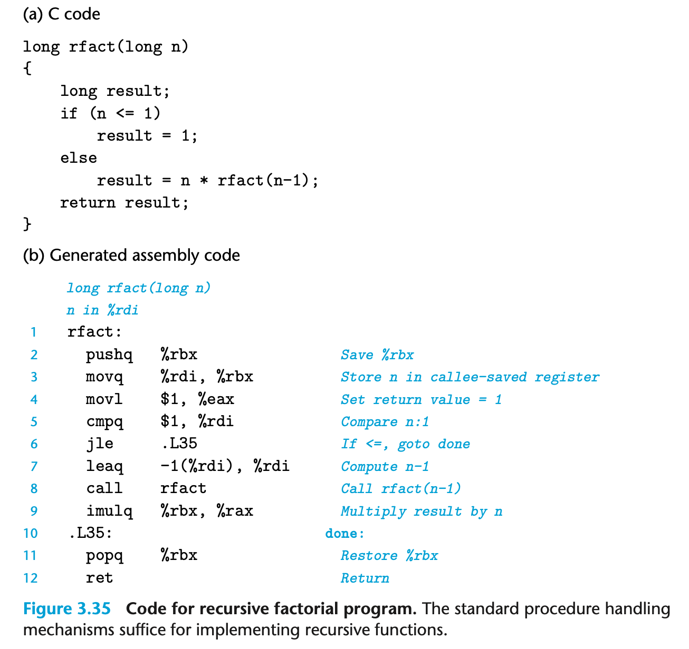

### Recursive Procedures

The conventions we have described for using the registers and the stack allow x86-64 procedures to call themselves recursively. Each procedure call has its own private space on the stack, and so the local variables of the multiple outstanding calls do not interfere with one another. Furthermore, the stack discipline naturally provides the proper policy for allocating local storage when the procedure is called and deallocating it before returning.

Figure 3.35 shows both the C code and the generated assembly code for a recursive factorial function. We can see that the assembly code uses register %rbx to hold the parameter n, after first saving the existing value on the stack (line 2) and later restoring the value before returning (line 11). Due to the stack discipline, and the register-saving conventions, we can be assured that when the recursive call to rfact(n-1) returns (line 9) that (1) the result of the call will be held in register %rax, and (2) the value of argument n will held in register %rbx. Multiplying these two values then computes the desired result.

We can see from this example that calling a function recursively proceeds just like any other function call. Our stack discipline provides a mechanism where each invocation of a function has its own private storage for state information (saved values of the return location and callee-saved registers). If need be, it can also provide storage for local variables. The stack discipline of allocation and deallocation naturally matches the call-return ordering of functions. This method of implementing function calls and returns even works for more complex patterns, including mutual recursion (e.g., when procedure P calls Q, which in turn calls P).

