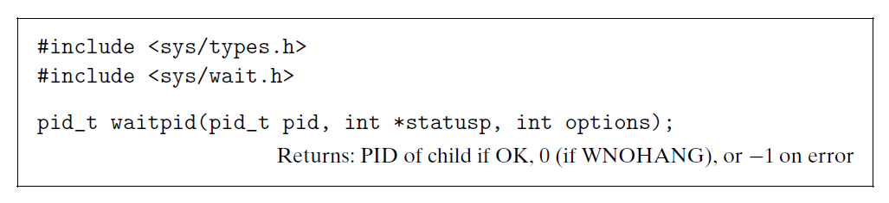

# Ch8 Exceptional Control Flow

## 8.4 Process Control

### 8.4.3 Reaping Child Processes

当进程终止时，内核并不会立即将其从系统中清除，进程保持在一种已终止的状态中（僵死进程），直至其被父进程回收。如果其父进程提前终止，那么此刻子进程为孤儿进程，可内核会安排 PID 为 1 的 init 进程来回收孤儿进程。

使用 waitpid 和 wait 系统调用来回收子进程，其各参数含义为：

* pid：等待子进程集合的成员。
    * 如果 pid > 0，则等待一个单独的子进程；
    * 如果 pid = -1，则等待集合为该父进程创建的所有子进程；
* options：修改等待的行为，例如阻塞，非阻塞
* statusp：检查已回收子进程的退出状态。
* errno：错误码

