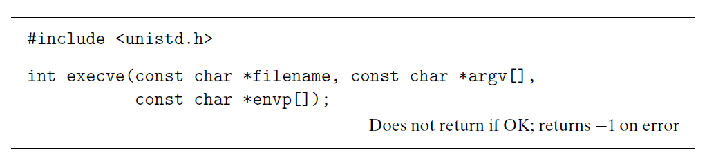

# Ch8 Exceptional Control Flow

## 8.4 Process Control

### 8.4.4 Putting Processes to Sleep

进程休眠的两个系统调用：

* `sleep`：指定让进程挂起秒数
* `pause`：调用休眠，直至该进程收到信号

### 8.4.5 Loading and Running Programs

`execve` 系统调用在当前进程的上下文中加载并运行一个新程序。

* argv：指针参数
* envp：环境变量

