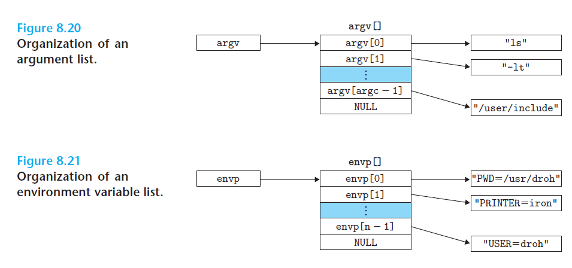
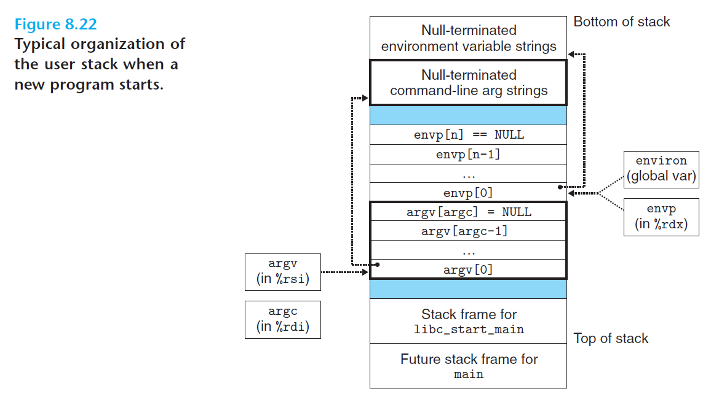

# Ch8 Exceptional Control Flow

## 8.4 Process Control

### 8.4.5 Loading and Running Programs

execve 的两个参数的组织如下：

execve 系统调用的过程如下：

1. 系统加载器将程序从磁盘复制到内存中（本质是完成虚拟地址空间的创建，磁盘到内存的复制需要等到 CPU 引用虚拟页时才开始加载），然后跳转至程序的第一条指令或者入口点来运行该程序；
2. mian 函数的开始后，用户栈的组织结构如下图所示，从高地址到低地址依次是：参数、环境字符串，随后是以 null 结尾的结尾的指针数组；栈的顶部是系统启动函数 `libc_start_main`。

