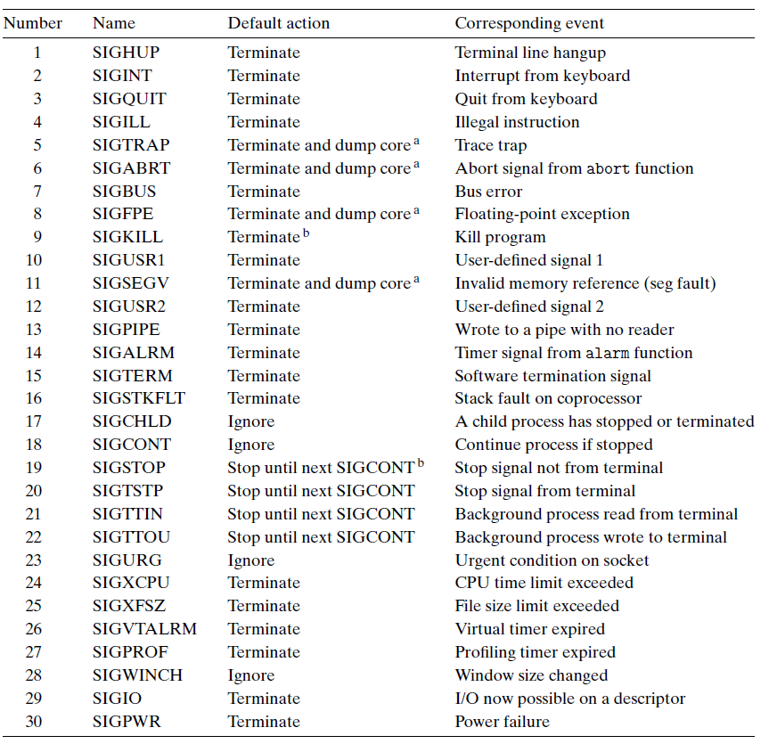

# Ch8 Exceptional Control Flow

## 8.6 Signals

Linux 信号是一种更加高层的软件形式的异常，其允许进程和内核中断其它进程。一个信号就是一条小消息，它通知系统进程中发生了一个某种类型的事件。

每种信号类型都对应于某种系统事件，低层的硬件异常是由内核异常处理程序处理的，这对用户进程是不可见的，信号提供了一种机制来通知用户进程发生了这些异常。

Linux 系统上支持的系统信号如下图：

