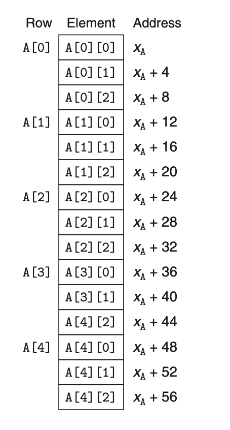

3.8.3 nested array

## define
```
int A[3][5];
```
is equivalent to the following:
```
typedef int row3[3];
row3 A[5];
```

total size: 4 * 3 * 5 = 60 bytes
array elements are stored in memory in row-major order.


```
T D[R][C];
&D[i][j] = $x_D+L*(C*i+j)$
```