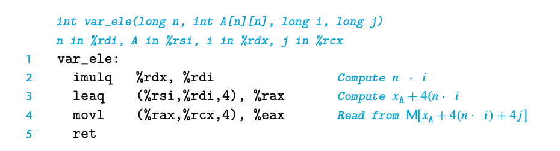
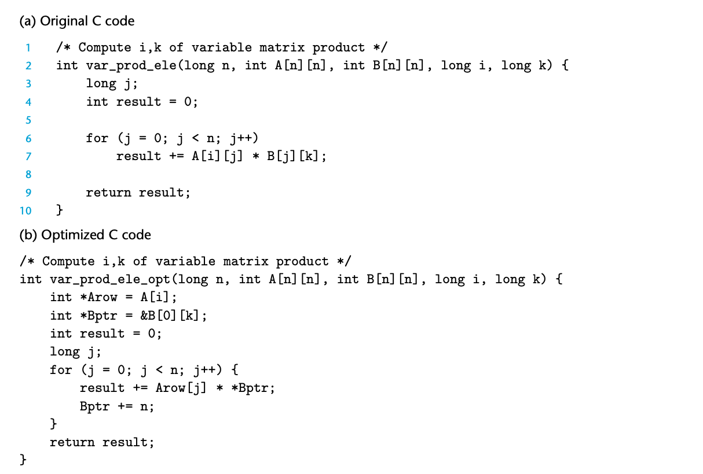

# variable-size arrays
早期的c语言支持编译时可确定的数组大小，但变长数组显然是一个很普遍的需要。
C99引入了这一特性。

```
int A[expr1][expr2]
```
这里，expr1和expr2可以是本地的变量。

```
int var_ele(long n, int A[n][n], long i, long j) {
    return A[i][j];
}
```
这是一个例子。

（可以注意到，这个和动态数组还是不一样的）

gcc是这样实现的



还会做下面这样的优化

