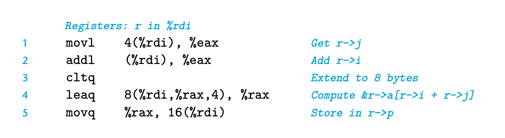
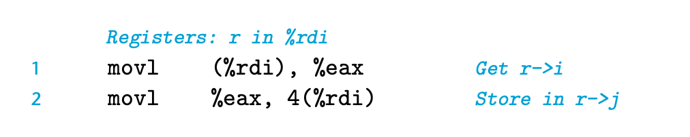

# 3.9 Heterogeneous Data Structures

structures: aggregate multiple object into one object
unions: allow an object to be referenced using different types

## 3.9.1 structures

```
struct rec {
    int i;
    int j;
    int a[2];
    int *p;
};
```

The compiler will maintain the information about the byte offset of fields in the struct.
The compiler will generate codes to access fields by compute the appropriate offset.
For example, suppose r of type struct rec* is in register %rdi.


