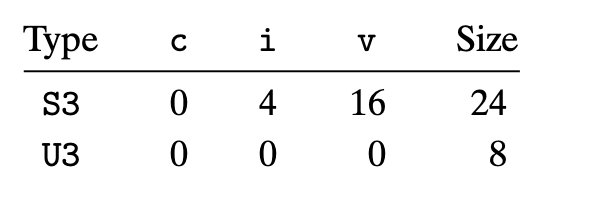

# 3.9.2 unions
union 是 C语言提供的一种对类型的增强；他可以让一个类型同时包含多种不同的类型；在内存中 union 的不同成员占用同一段空间，所需空间为成员类型中需要的最大的内存空间。
union 是一种相对不安全的语法，使用的场合比较有限，大部分是为了节约内存空间，下面是一个例子。

```
struct S3 {
    char c;
    int i[2];
    double v; 
};

struct U3 {
    char c;
    int i[2];
    double v; 
};
```

内存布局如下：

（因为内存有对齐的处理，所以S3的i的偏移量不是1）

一个常用的场景如下，可以帮助我们减少内存开销：
```
struct node_s {
      struct node_s *left;
      struct node_s *right;
      double data[2];
};

union node_u {
      struct {
          union node_u *left;
          union node_u *right;
      } internal;
      double data[2];
  };
```

问题在于我们并不能直接从内存中直接判断当前类型是union中的哪个成员，因此一种常用的范式是我们在union中加入一个type枚举，像下面这样：
```
typedef enum { N_LEAF, N_INTERNAL } nodetype_t;
struct node_t {
    nodetype_t type;
    union {
        struct {
            struct node_t *left;
            struct node_t *right;
        } internal;
        double data[2];
    } info;
};
```