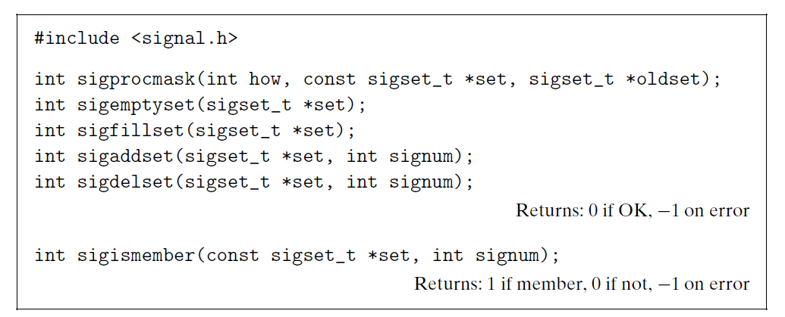

# Ch8 Exceptional Control Flow

## 8.5 Signals

### 8.5.4 Blocking and Unblocking Signals

Linux 阻塞信号的机制：

* 隐式阻塞机制：内核默认阻塞任何当前处理程序正在处理信号类型的待处理的信号。
* 显示阻塞机制：应用程序使用 `sigpromask` 等相关函数，明确的阻塞和解除阻塞选定的信号。

