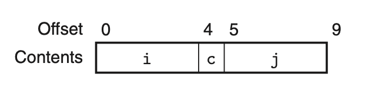
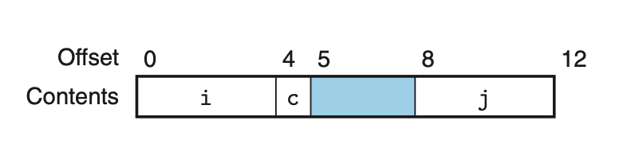

# 3.9.3 data alignment

很多系统都要求对象的地址被K整除，K通常为2，4，8等。 这是为了简化硬件的处理器和内存接口。
比如，处理器每次读操作都从内存获取8字节，在对齐的情况下，只需要一次读就可以读出一个double变量。但如果非对齐，则可能需要读两次，因为double可能跨两个8byte。

编译器在处理结构体的时候可能就需要在字段之间插入间隔。

```
struct S1 {
      int  i;
      char c;
      int  j;
};
```
这是最少需要的内存：


这是4对齐 编译器实际在内存中对结构体的表示：
