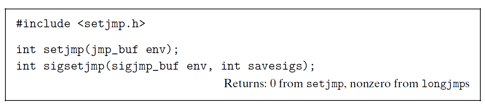
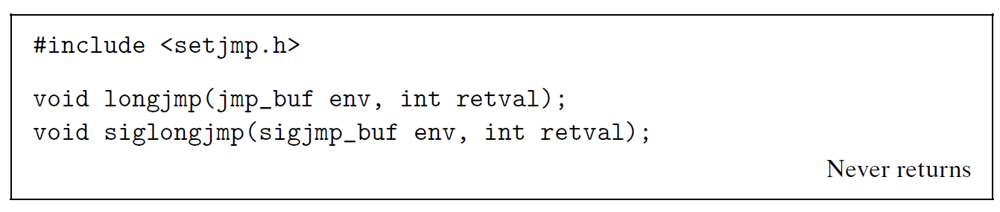

# Ch8 Exceptional Control Flow

## 8.6 Nonlocal Jumps

C 语言提供了一种用户级异常控制流形式，为 nonlocal jump，其将控制直接从一个函数转移到另一个当前正在执行的函数，而不需要经过正常的调用-返回序列。

* setjmp 函数在 env 缓冲区中保存当前调用环境，供后面的 longjmp 使用，并返回 0，调用环境包括程序计数器、栈指针和通用目的寄存器。setjmp 的返回值不能被赋值给变量，仅能在条件语句或 switch 语句中使用。
* longjmp 函数从 env 缓冲区中恢复调用环境，然后触发一个从最近一次初始化的 env 的 setjmp 调用的返回。