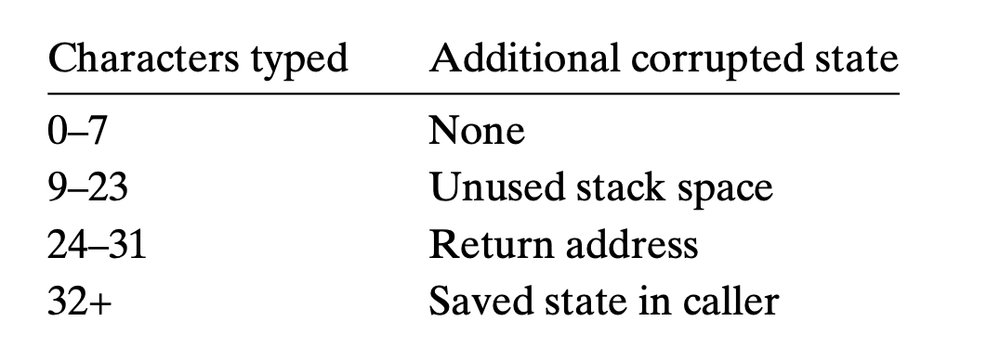
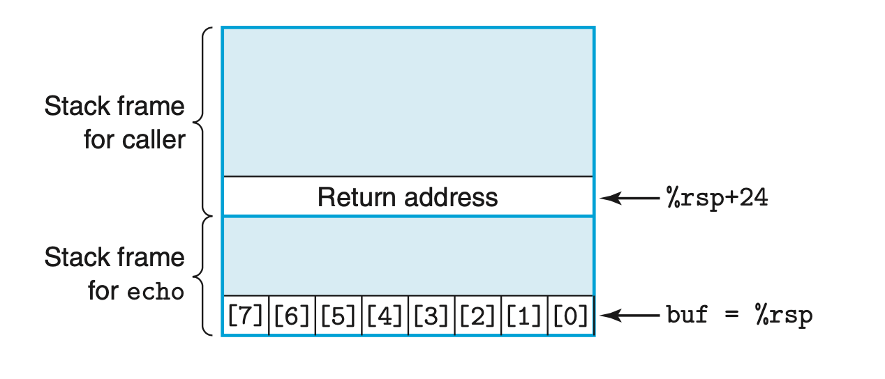

### 3.10.2 Life in the Real World: Using the gdb Debugger
GDB 是一款常用的代码调试工具。通常的使用方式是在感兴趣的代码处打断点，等代码运行到这里会halt以便用户调试，具体来说就是进行控制和查看变量值等操作。
用户可以控制程序单步执行。 OBJDUMP可以帮助我们了解的代码情况。

### 3.10.3 Out-of-Bounds Memory References and Buffer Overflow
由于C语言没有对数组的边界检查，stack被越界的数组写覆盖了，会导致程序有严重的问题。
这种错误被称为 buffer overflow 

```c
char *gets(char *s)
{
    int c;
    char *dest = s;
    while ((c = getchar()) != '\n' && c != EOF)
        *dest++ = c;
    if (c == EOF && dest == s)
        /* No characters read */
        return NULL;
    *dest++ = '\0'; /* Terminate string */
    return s; 
}

/* Read input line and write it back */
void echo()
{
    char buf[8];  /* Way too small! */
    gets(buf);
    puts(buf);
}
```

这段代码的问题在于没有确认char数组的大小，如果数组很小，则会导致越界的写。


在这个例子中strings长度超过23之后，就会导致栈中的ret地址被覆写，从而导致程序跳转到一个未知的地址。


