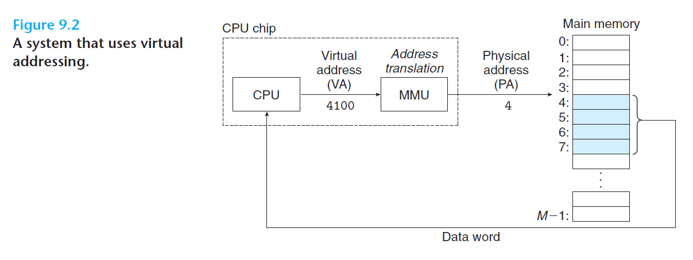

# Ch9 Exceptional Control Flow

## 9.1 Physical and Virtual Addressing

物理寻址：计算机系统的主存被组织成一个由 M 个连续的字节大小的单元组成的数组，每字节都有唯一的物理地址。CPU 使用物理地址进行内存访问，通过内存总线将其传递给主存，主存取出物理地址中内容将其返回给 CPU，CPU 将其放在一个寄存器中。

虚拟寻址：现代 CPU 使用虚拟地址来进行寻址。CPU 生成虚拟地址，然后使用 MMU 进行地址翻译，MMU 使用其放在主存中的查询表来动态翻译虚拟地址为物理地址。

