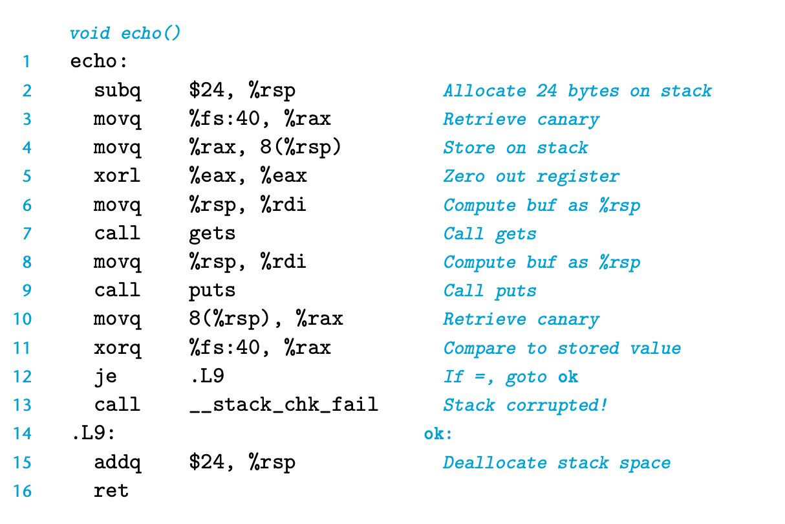

### 3.10.4 Thwarting Buffer Overflow Attacks

Stack Corruption Detection

另一个阻止缓冲区溢出攻击的手段是 Stack Corruption Detection 。

在C语言中，我们不能直接阻止写越界，但是可以在这样的行为发生时识别出来进而防止实质性的攻击产生。

在新版的GCC中，我们引入了 stack protector 机制。具体做法成本很低，就是在每个栈开始的地方引入一个 canary value， 通常是随机生成的，从而攻击者并不能有效预测。
GCC在函数执行体前会将canary value写入栈中，最后返回前会对这个值进行校验。如果返回前发现该值变化了，则说明缓冲区溢出攻击发生了，则抛出异常。

