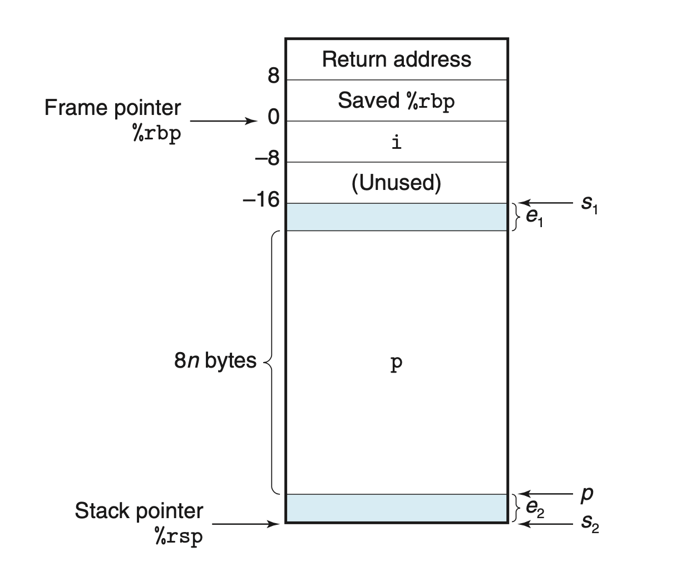
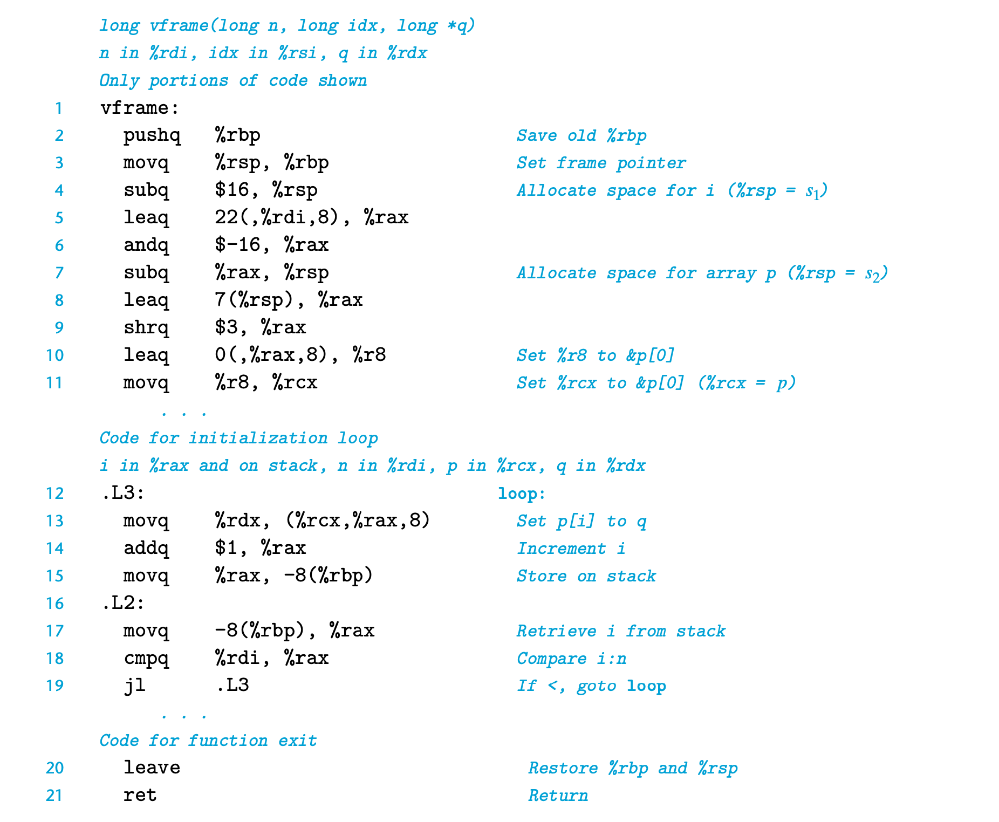

# 3.10.5 Supporting Variable-Size Stack Frames
```c
long vframe(long n, long idx, long *q)  {
    long i;
    long *p[n];
    p[0] = &i;
    for (i = 1; i < n; i++)
        p[i] = q;
    return *p[idx];
}
```

有时编译器需要支持变长的栈空间，通常为函数中有动态大小的数组，数组大小由函数入参确定。


生成的汇编代码如下：


frame pointer 在x86-64中只有在变长栈空间的场景下才会使用。