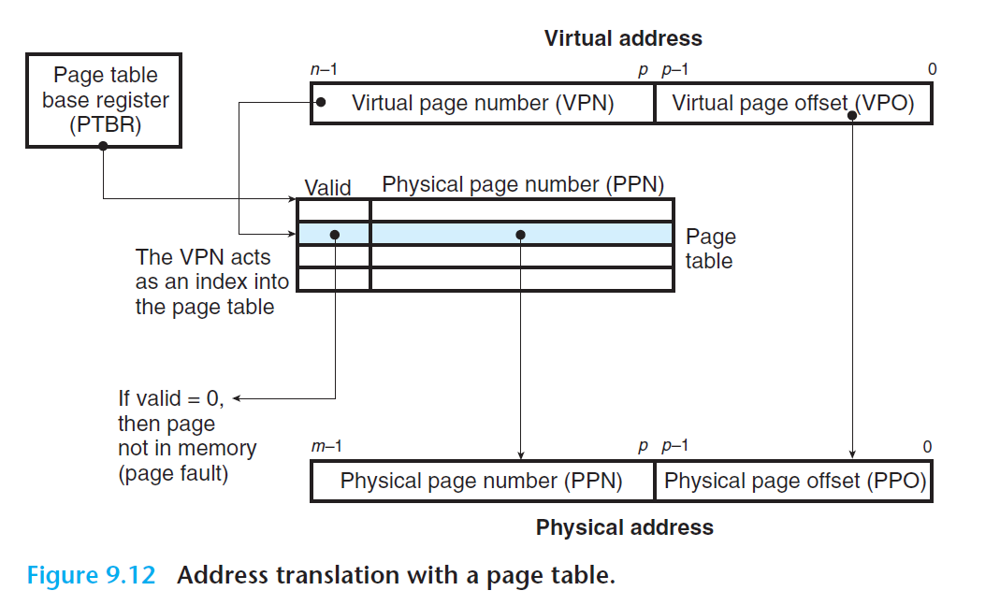

# Ch9 VM as a Tool for Caching

## 9.6 Address Translation

CPU 中的一个控制寄存器，页表基址寄存器（PTBR，Page Table Base Register）指向当前页表，n 位的虚拟地址包含两个部分：一个 p 位的虚拟页面偏移（Virtual Page Offset，VPO）和一个 (n - p) 位的虚拟页号（Virtual Page Number，VPN），MMU 利用 VPN 来选择合适的 PTE，将 PTE 中记录的物理页号和虚拟地址的 VPO 连接起来，就得到了相应的物理地址。

