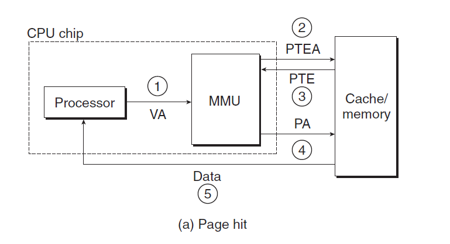
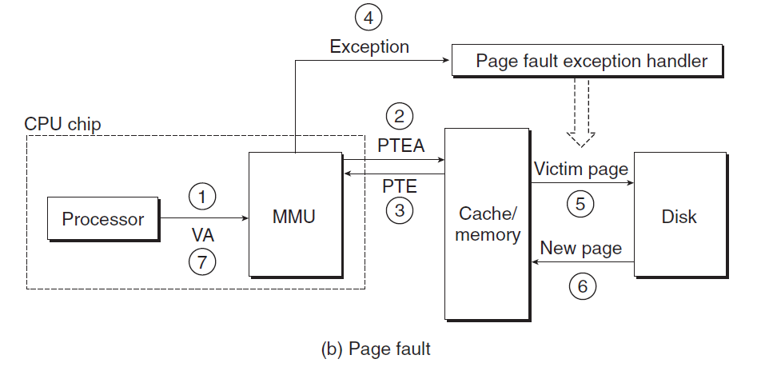

# Ch9 VM as a Tool for Caching

## 9.6 Address Translation

地址翻译步骤：

* 页命中时：

    1. 处理器生成一个虚拟地址，并将其传送给 MMU；
    2. MMU 生成 PTE 地址，并从高速缓存/主存请求得到该地址；
    3. 高速缓存/主存向 MMU 回传 PTE；
    4. MMU 构造物理地址，并把它传送给高速缓存/主存；
    5. 高速缓存/主存返回所请求得数据字给处理器。

    

* 缺页时：

    1. 同上述 1 - 3 步；
    2. PTE 中的有效位是 0，所以 MMU 触发了一次异常，传递 CPU 中的控制到操作系统内核中的缺页异常处理程序；
    3. 缺页处理程序确定物理内存中的牺牲页，如果该页面已经被修改了，则将其换出磁盘；
    4. 缺页处理程序页面调入新的页面，并更新内存中的 PTE；
    5. 缺页处理程序返回原来的进程，重新执行导致缺页的指令，此时 CPU 将引起缺页中的虚拟地址重新发送给 MMU。

