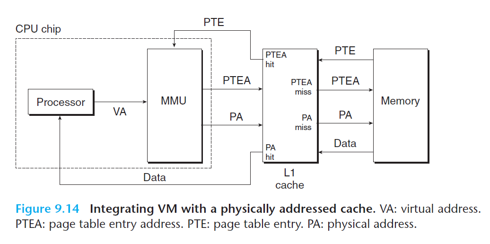

# Ch9 VM as a Tool for Caching

## 9.6 Address Translation

### 9.6.1 Integrating Caches and VM

在同时使用虚拟内存和 SRAM 的系统中，大部分系统都选择使用物理寻址，使得多个进程可以同时在高速缓存中有存储块和共享来自相同虚拟页面的块，而且无需进行权限检查问题，将权限检查放到地址翻译阶段完成。

