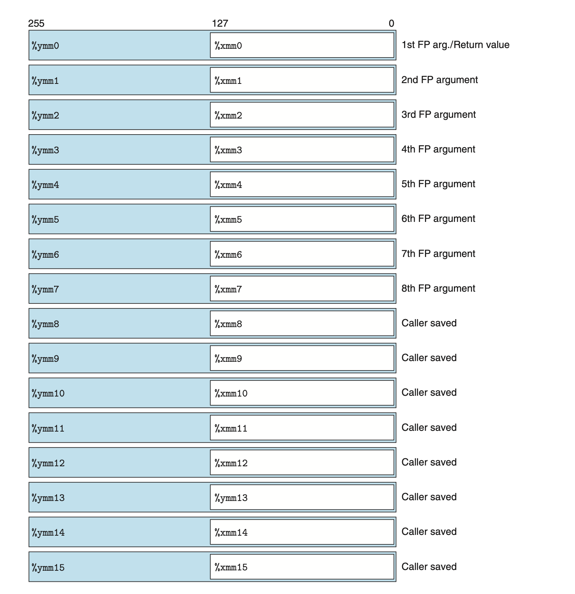

# 3.11 Floating-Point Code
浮点-架构 影响着程序运行时的诸多方面：
1. 浮点如何存储
2. 浮点相关的指令
3. 调用函数的时候如何传递浮点参数、如何返回浮点结果
4. 调用函数的时候如何保存现场

在 Intel Core i7 的 AVX 架构下，我们可以用 16 个 YMM 寄存器存储数据，每个寄存器有32字节；但是存浮点数时，我们只用低位的32位或64位。
写成汇编代码为 `%xmm0–%xmm15` 。

