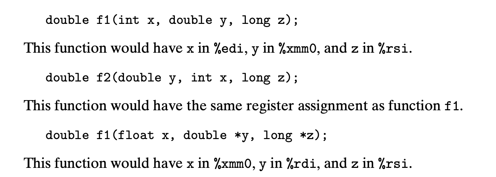

# 3.11.2 Floating-Point Code in Procedures
floating相关的函数调用里，参数传递和返回值都会采用XMM寄存器。
我们有以下3个观察：
1. 通过XMM寄存器传递的floating参数最多只能有8个，更多的可以放在stack中传递。
2. 返回floating类型的函数会通过 XMM0 寄存器传递返回值。
3. XMM寄存器的值由 caller 管理， callee在覆盖XMM寄存器的时候并不负责保存现场。

参数和寄存器的映射不止取决于顺序，也取决于类型，以上是一个例子。