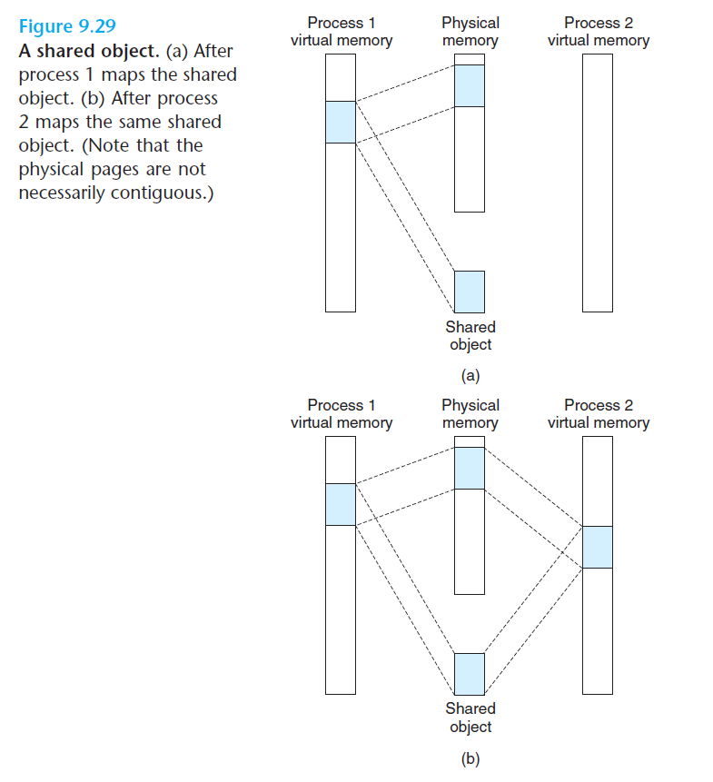

# Ch9 VM as a Tool for Caching

## 9.8 Memory Mapping

### 9.8.1 Shared Objects Revisited

内存映射提供了一种机制，用户控制多个进程如何共享对象。一个对象可以被映射到虚拟内存的一个区域，要么做么共享对象，要么作为私有对象。

私有对象通常使用写时复制（copy on write）来映射到虚拟内存中。

例如，两个进程将一个私有对象映射到它们的虚拟内存的不同区域，但是共享这个对象的同一物理副本，此时会将该区域结构标识位私有的写时复制，只要不对该区域进行读操作，那么其可以继续共享物理内存中对象的一个单独副本。

如果有一个进程试图写私有区域内的某个页面，那么这个写操作就会触发一个保护故障；随后会在物理内存中创建该页面的一个副本，更新页表条目指向这个新副本，然后恢复该页面的可写权限，故障处理程序返回后，CPU 重新执行写操作，此后在该页面上的写操作可以正常执行了。

