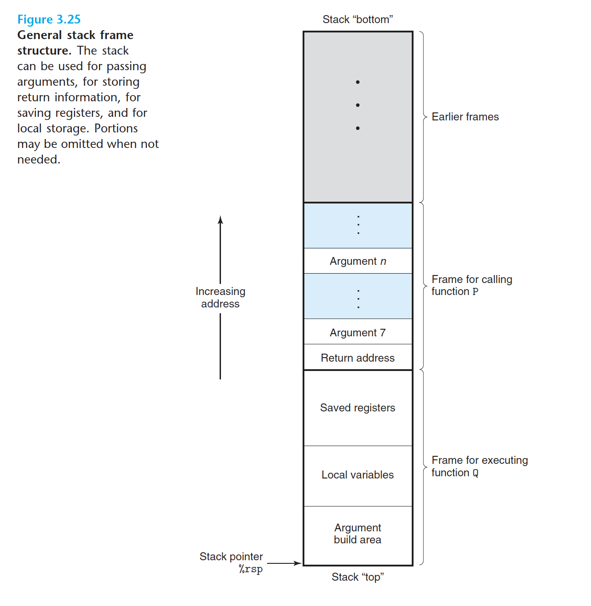

When an x86-64 procedure requires storage beyond what it can hold in registers, it allocates space on the stack. This region is referred to as the procedure’s stack frame. Figure 3.25 shows the overall structure of the run-time stack, including its partitioning into stack frames, in its most general form. The frame for the currently executing procedure is always at the top of the stack.When procedure P calls procedure Q, it will push the return address onto the stack, indicating where within P the program should resume execution once Q returns. We consider the return address to be part of P’s stack frame, since it holds state relevant to P. The code for Q allocates the space required for its stack frame by extending the current stack boundary.Within that space, it can save the values of registers, allocate stack frame. Figure 3.25 shows the overall structure of the run-time stack, including its partitioning into stack frames, in its most general form. The frame for the currently executing procedure is always at the top of the stack.When procedure P calls procedure Q, it will push the return address onto the stack, indicating where within P the program should resume execution once Q returns. We consider the return address to be part of P’s stack frame, since it holds state relevant to P. The code for Q allocates the space required for its stack frame by extending the current stack boundary.Within that space, it can save the values of registers, allocate

