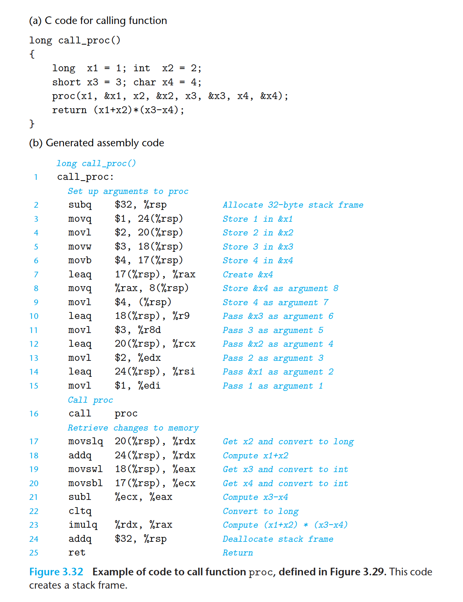

 With x86-64, up to six integral (i.e., integer and pointer) arguments can be 

 passed via registers. The registers are used in a specified order, with the name 

 used for a register depending on the size of the data type being passed. These are 

 shown in Figure 3.28. Arguments are allocated to these registers according to their 

 ordering in the argument list. Arguments smaller than 64 bits can be accessed using 

 the appropriate subsection of the 64-bit register. For example, if the first argument 

 is 32 bits, it can be accessed as   %edi  . 

 When a function has more than six integral arguments, the other ones are 

 passed on the stack. Assume that procedure   P   calls procedure   Q   with   n   integral 

 arguments, such that   n >   6. Then the code for   P   must allocate a stack frame with 

 enough storage for arguments 7 through   n  , as illustrated in Figure 3.25. It copies 

 arguments 1–6 into the appropriate registers, and it puts arguments 7 through   n 

 onto the stack, with argument 7 at the top of the stack.When passing parameters 

 on the stack, all data sizes are rounded up to be multiples of eight. With the 

 arguments in place, the program can then execute a   call   instruction to transfer 

 control to procedure   Q  . Procedure   Q   can access its arguments via registers and 

 possibly from the stack. If   Q  , in turn, calls some function that has more than six 

 arguments, it can allocate space within its stack frame for these, as is illustrated 

 by the area labeled “Argument build area” in Figure 3.25. 

 As an example of argument passing, consider the C function   proc   shown in 

 Figure 3.29(a). This function has eight arguments, including integers with different 

 numbers of bytes (8, 4, 2, and 1), as well as different types of pointers, each of which 	 is 8 bytes. 

 The assembly code generated for   proc   is shown in Figure 3.29(b). The first 

 six arguments are passed in registers. The last two are passed on the stack, as 

 documented by the diagram of Figure 3.30. This diagram shows the state of the 

 stack during the execution of   proc  .We can see that the return address was pushed 

 onto the stack as part of the procedure call. The two arguments, therefore, are 

 at positions 8 and 16 relative to the stack pointer. Within the code, we can see 

 that different versions of the add instruction are used according to the sizes of the 

 operands:   addq   for   a1   (  long  ),   addl   for   a2   (  int  ),   addw   for   a3   (  short  ), and   addb   for 

 a4   (  char  ). Observe that the   movl   instruction of line 6 reads 4 bytes from memory; 

 the following   addb   instruction only makes use of the low-order byte. 

