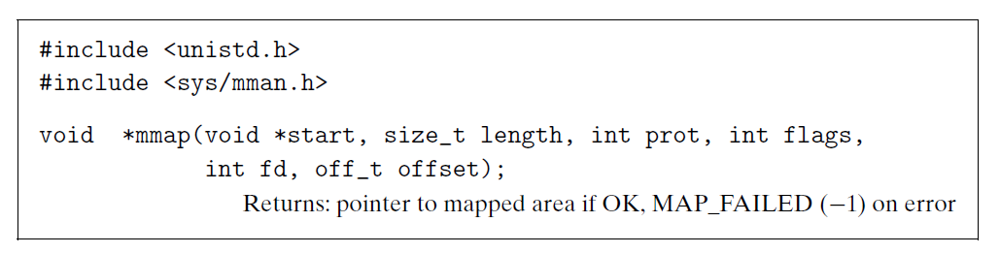
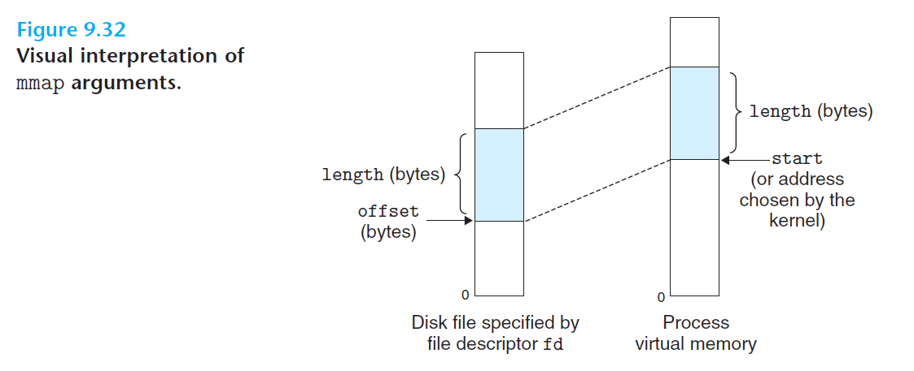

# Ch9 VM as a Tool for Caching

## 9.8 Memory Mapping

### 9.8.4 User-Level Memory Mapping with the mmap Function

Linux 进程可以使用 mmap 来创建新的虚拟内存区域，并将对象映射到这些区域中。

mmap 函数要求内核创建一个新的虚拟内存区域，最好是从地址 start 开始的一个区域，并将文件描述符 fd 指定的对象的一个连续的片（chunk）映射到这个新的区域。连续的对象片大小为 length 字节，从距文件开始处偏移量为 offset 字节的地方开始。

参数 port 包含描述新映射的虚拟内存区域的访问权限位（即在相应区域结构中的 vm_port 位）:

* PROT_EXEC：这个区域内的页面由可以被 CPU 执行的指令组成。
* PROT_READ：区域内的页面可读
* PROT_WRITE：区域内的页面可写
* PROT_NONE：区域内的页面不能被访问

参数 flags 由描述被映射对象类型的位组成：

* MAP_ANON：被映射的对象是一个匿名对象，而相应的虚拟页面是请二进制零的。
* MAP_PRITVATE：被映射的对象是一个私有的、写时复制的对象。
* MAP_SHARED：被映射的对象是一个共享对象。