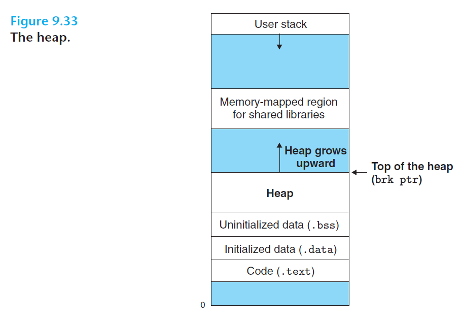

# Ch9 VM as a Tool for Caching

## 9.9 Dynamic Memory Allocation

动态内存分配器维护着一个进程的虚拟内存区域，成为堆。假设堆是一个请求二进制零的区域，它紧接在未初始化的数据区域后开始，并向更高地址区域生长。对于每个进程，内核维护着一个变量 brk，指向堆的顶部。

分配器将堆视为一组不同大小的块的集合来维护，每个块就是一个连续的虚拟内存片。

