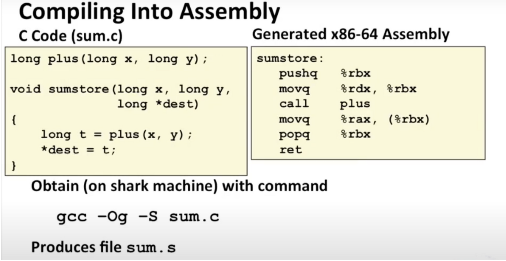

# Machine-Level Programming I:Basic

### C语言代码的编译过程

过程包括：

1.编译：C语言生成汇编语言代码

2.汇编：将汇编语言代码生成目标代码

3.链接：链接其他的library的代码，生成最后的机器代码

1.编译

汇编语言的特性：

整数

浮点数

代码其实是字节序列

一些数据结构，如数组、结构体实际上不存在于汇编层面，只是编译器构造出来的东西

每条指令只能做一件特定的事情：可以将数据从寄存器移动到内存，进行加法或者减法，等等