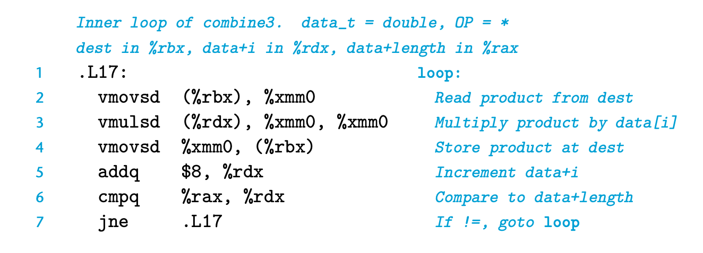
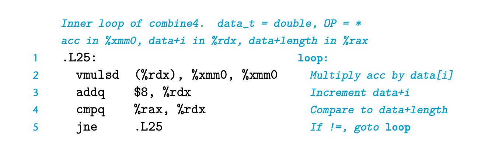
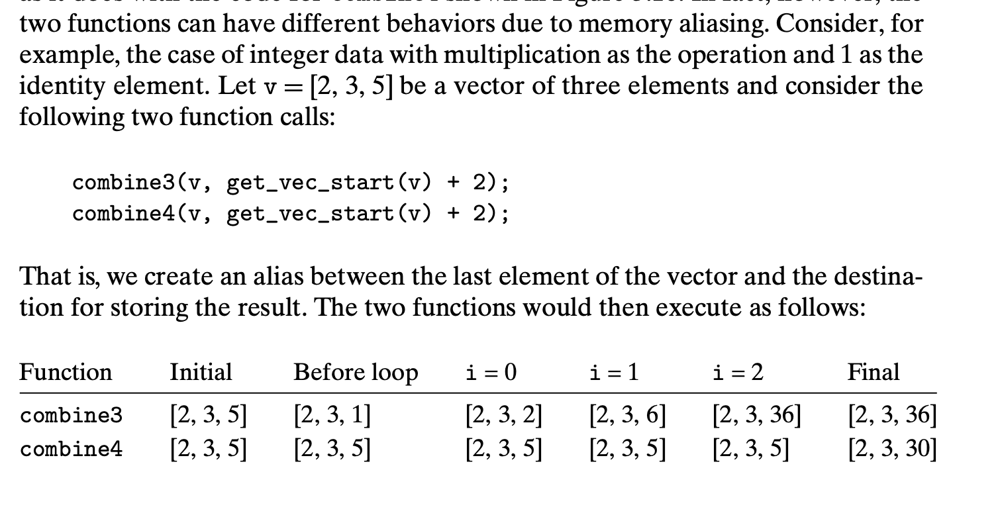

## 5.6 Eliminating Unneeded Memory References

combine3:

```c
/* Direct access to vector data */
void combine3(vec_ptr v, data_t *dest) {
    long i;
    long length = vec_length(v);
    data_t *data = get_vec_start(v);
    *dest = IDENT; 
    for(i=0;i<length;i++) {
        *dest = *dest OP data[i];
    }
}
```

inner loop:



这里其实不用在每个循环都对 accumulated value 进行memory的读和写 （只要读寄存器的就行）


```c
void combine4(vec_ptr v, data_t *dest)
{
    long i;
    long length = vec_length(v);
    data_t *data = get_vec_start(v);
    data_t acc = IDENT;
    double acc = *dest;
    for (i = 0; i < length; i++) {
        acc = acc OP data[i];
    }
    *dest = acc;
}
```
这样性能更好。



提升显著

但是这件事，编译器也不是简单就可以完成的。由于内存对齐，这两个函数可能会有不同的结果。
