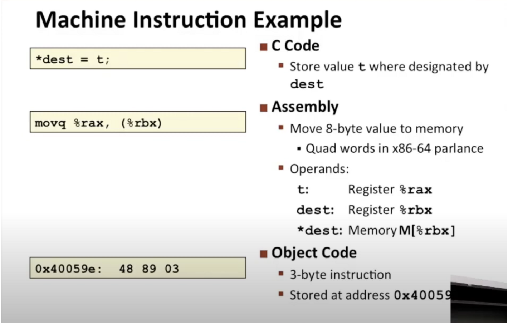
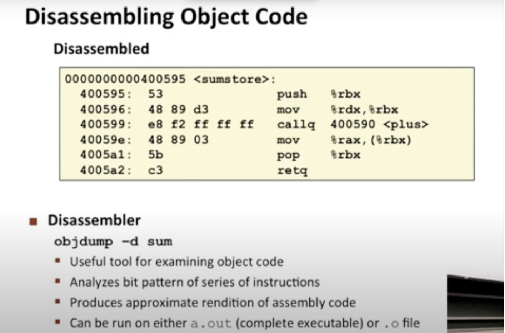
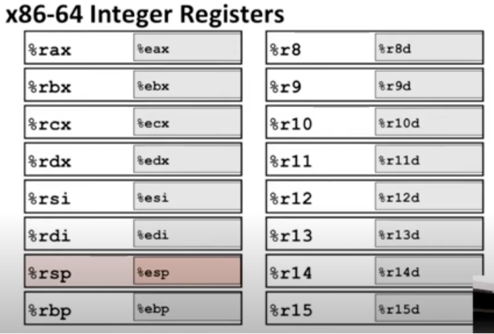
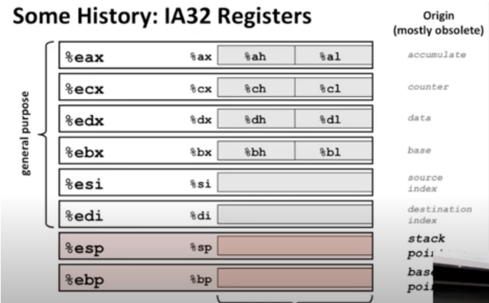
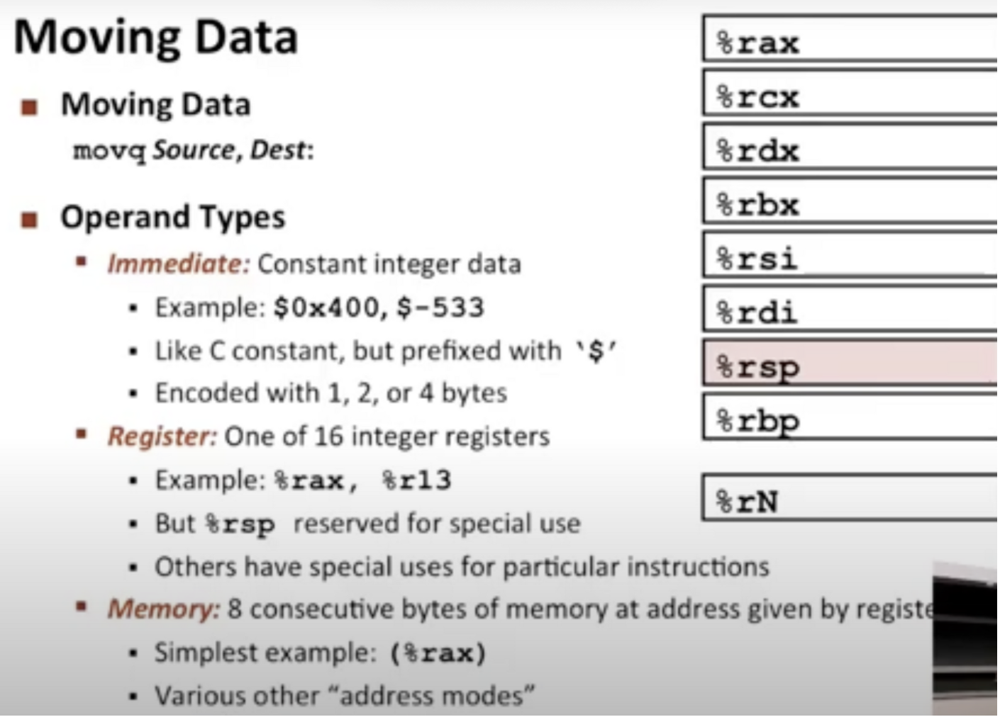
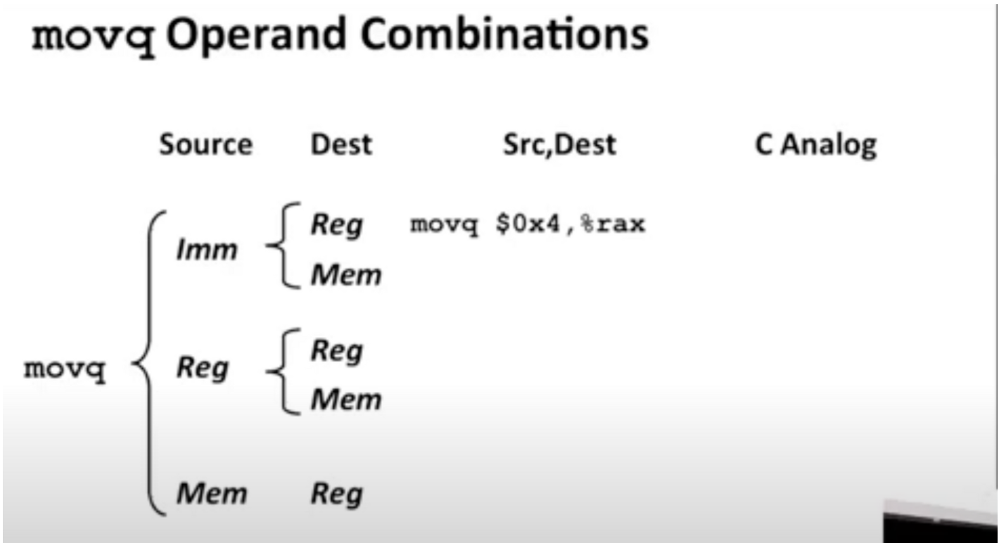

1. 指令编译

   

   可以看到编译后占用的空间逐渐减少

   变量名会去掉

   反汇编

   从机器代码到汇编代码的过程

   

   寄存器

   

   %r使用64位

   %e使用32位

   %e只是较大%r实体的低32位

   还能只使用16位（2字节）和8位（1字节）的空间

   可以在寄存器存取值

   更早期的寄存器，并用它举例如何使用

   

   移动数据

   

   所有move操作的可能性（5种）

   

   立即值可以写入寄存器或者直接写入内存

   寄存器值可以复制到另一个寄存器或者写入内存

   在内存中取出一个值，从内存中读取它并将其复制到寄存器中

   （由于设计问题，不允许内存到内存，你可以将内存复制到寄存器，然后在寄存器中取值并写入内存）