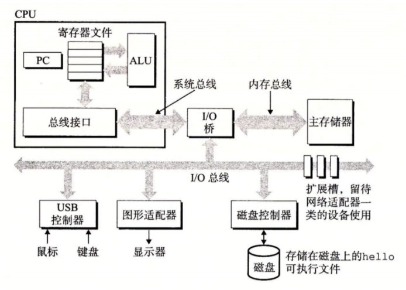
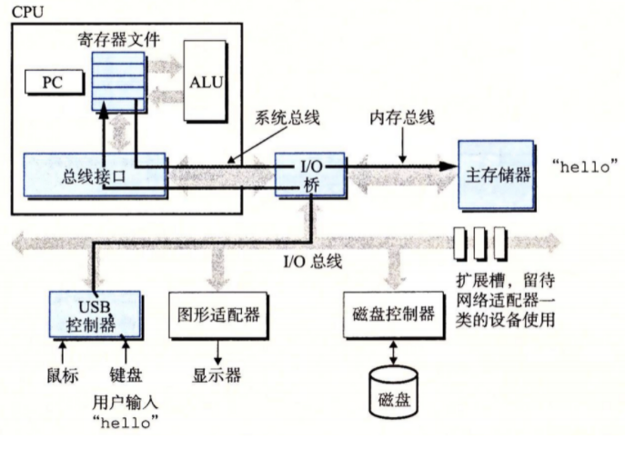
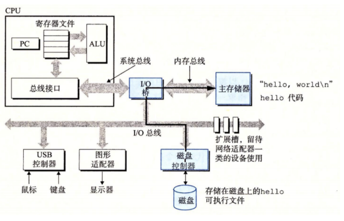
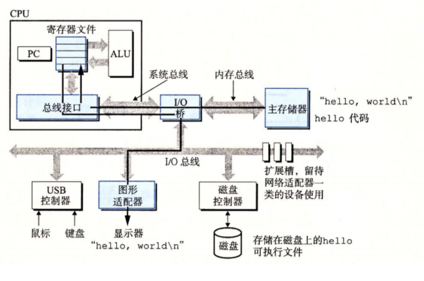

## 系统的硬件组成

## 1.总线

贯穿整个系统的**电子管道**

它**携带信息字节**并负责在各个部件间**传递**

通常总线被设计成传送**定长**（一般是**4个字节【32位】\**或者\**8个字节【64位】**）的字节块，也就是字

## 2.I/O设备

I/O（输入/输出）设备是系统与外部世界的联系通道

鼠标，键盘，显示器，硬盘等

每个 I/O 设备都通过一个**控制器**或**适配器**与 I/O 总线相连，功能都是在 I/O 总线和 I/O 设备之间传递信息

控制器和适配器之间的区别主要在于它们的封装方式：

- 控制器是 I/O 设备本身或者系统的主印制电路板（通常称作主板）上的芯片组。
- 而适配器则是一块插在主板插槽上的卡

> 图 1-4 一个典型系统的硬件组成 CPU：中央处理单元；ALU：算术/逻辑单元；PC：程序计数器；USB：通用串行总线

## 3.主存

**主存**是一个临时存储设备，在处理器执行程序时，用来存放程序和程序处理的数据

- 从物理上来说：主存是由一组**动态随机存取存储器**（DRAM）芯片组成的
- 从逻辑上来说：存储器是一个线性的字节数组，每个字节都有其唯一的地址（数组索引），这些地址是从零开始的

## 4.处理器

**中央处理单元**（CPU），简称**处理器**，是解释（或执行）存储在主存中指令的引擎

处理器的核心是一个大小为一个字的存储设备（或**寄存器**），称为**程序计数器**（PC）

在任何时刻，PC 都指向主存中的某条机器语言指令（即含有该条指令的地址）。

从系统通电开始，直到系统断电，处理器一直在不断地执行程序计数器指向的指令，再更新程序计数器，使其指向下一条指令。

完成简单操作（围绕主存、**寄存器文件**（register file）和**算术/逻辑单元**（ALU）进行）：

比如：

- **加载：**从主存复制一个字节或者一个字到寄存器，以覆盖寄存器原来的内容。
- **存储：**从寄存器复制一个字节或者一个字到主存的某个位置，以覆盖这个位置上原 来的内容。
- **操作：**把两个寄存器的内容复制到 ALU，ALU 对这两个字做算术运算，并将结果存放到一个寄存器中，以覆盖该寄存器中原来的内容。
- **跳转：**从指令本身中抽取一个字，并将这个字复制到程序计数器（PC）中，以覆盖 PC 中原来的值。

## 运行hello程序

1.当我们在键盘上输人字符串 “./hello” 后，shell 程序将字符逐一读入寄存器，再把它存放到内存中

2.shell 执行一系列指令来加载可执行的 hello 文件，这些指令将 hello 目标文件中的代码和数据从磁盘复制到主存。数据包括最终会被输出的字符串 “hello, world\n”。

3.一旦目标文件 hello 中的代码和数据被加载到主存，处理器就开始执行 hello 程序的 main 程序中的机器语言指令。这些指令将 “hello, world\n” 字符串中的字节从主存复制到寄存器文件，再从寄存器文件中复制到显示设备，最终显示在屏幕上

