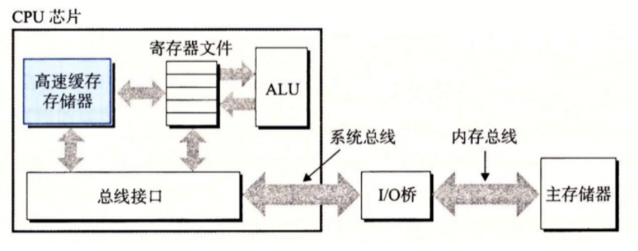
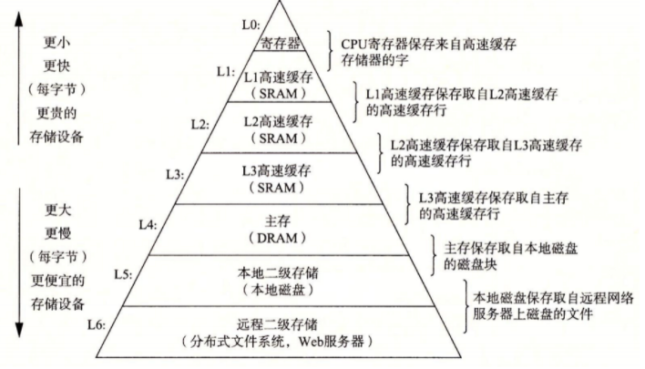

## 程序运行

shell里面执行命令后，程序和数据加载：

磁盘 ⇒ 主存

处理器运行程序时：

指令又从主存 ⇒ 处理器（PC和寄存器和ALU处理）

## 高速缓存存储器的出现

前提：

一个典型的寄存器文件只存储几百字节的信息，而主存里可存放几十亿字节。然而，处理器从寄存器文件中读数据比从主存中读取几乎要快 100 倍

因此：

针对这种处理器与主存之间的差异，系统设计者采用了更小更快的存储设备，称为**高速缓存存储器** （cache memory，简称为 cache 或高速缓存），作为暂时的集结区域，存放**处理器近期可能会需要的信息。**

## L1、L2和L3

位于处理器芯片上的 L1 高速缓存的容量可以达到数万字节，访问速度几乎和访问寄存器文件一样快。一个容量为数十万到数百万字节的更大的 L2 高速缓存通过一条特殊的总线连接到处理器。进程访问 L2 高速缓存的时间要比访问 L1 高速缓存的时间长 5 倍，但是这仍然比访问主存的时间快 5~10 倍。L1 和 L2 高速缓存是用一种叫做**静态随机访问存储器** （SRAM）的硬件技术实现的。比较新的、处理能力更强大的系统甚至有三级高速缓存∶L1、L2 和 L3。

## 存储层次结构

存储器层次结构的主要思想是**上一层的存储器作为低一层存储器的高速缓存**。因此，寄存器文件就是 L1 的高速缓存，L1 是 L2 的高速缓存，L2 是 L3 的高速缓存，L3 是主存的高速缓存，而主存又是磁盘的高速缓存。在某些具有分布式文件系统的网络系统中，本地磁盘就是存储在其他系统中磁盘上的数据的高速缓存。 正如可以运用不同的高速缓存的知识来提高程序性能一样，程序员同样可以利用对整个存储器层次结构的理解来提高程序性能。