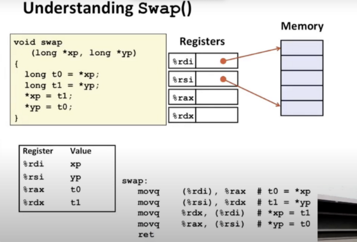
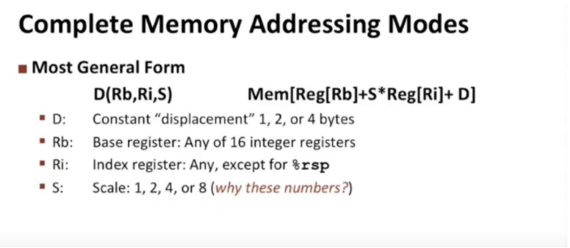
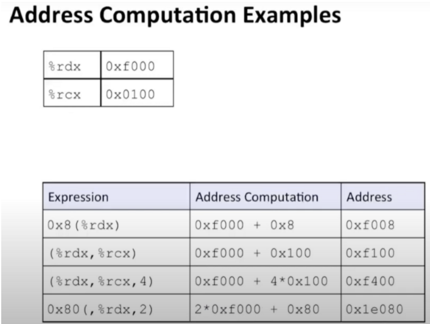
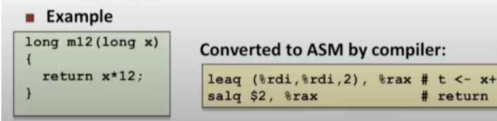
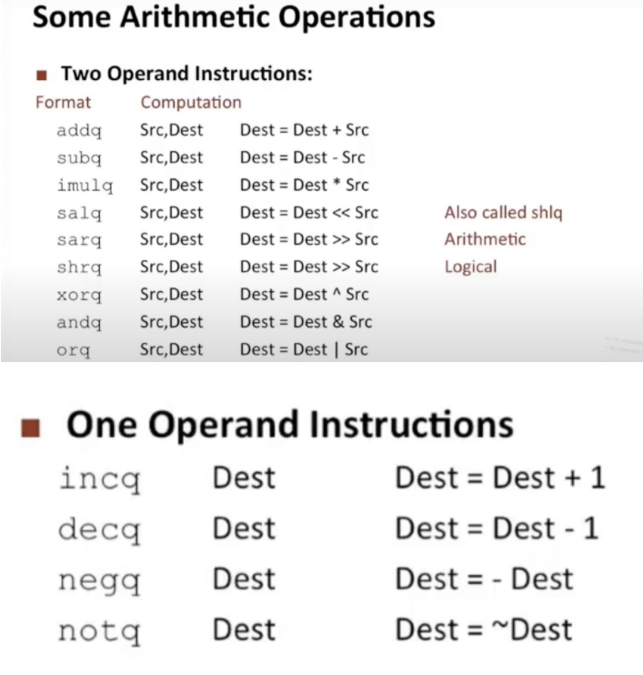
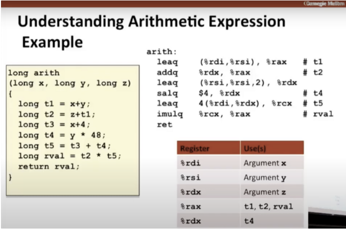

### 移动数据例子

第一条指令：使用%rdi作为地址，从该内存位置复制并将结果存储在寄存器%rax中

第二条指令：使用%rsi作为地址，从该内存位置复制并将结果存储在寄存器%rdx中

第三条指令：写回内存，源是寄存器%rdx，目的地的地址为%rdi

第四条指令：写回内存，源是寄存器%rax，目的地的地址为%rsi

带有位移的版本：

实现数组引用很有用，实际可能涉及2个寄存器

D：固定的偏移量

S：比例因子（1，2，4，8）

## Arithmetic

### 地址运算：

下面汇编代码的意思：

leaq得到3倍的leaq的值

salq左移，最后得到12倍的值

### 其他汇编算术运算：

### 一个具体完整的汇编代码例子

