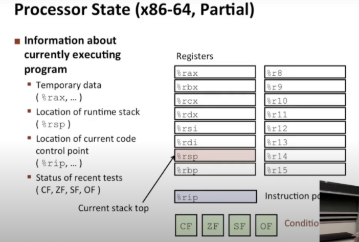
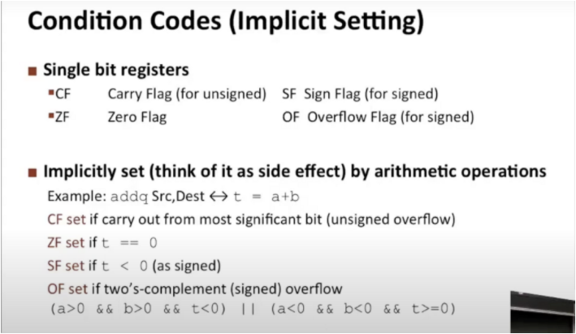
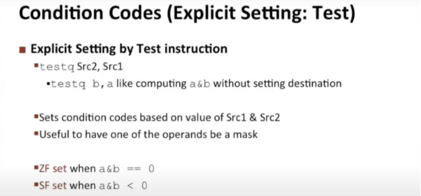

学习代码执行顺序的控制知识，也就是如何控制机器级别指令的执行顺序，如何使用这些技术来实现基本条件语句，循环和switch语句

Control：Condition codes

%rsp：存储程序运行时栈，里面有非常多的状态信息，控制着过程的执行

%rip：指令指针。告诉你程序执行到哪，当前正在执行的程序的哪个部分

CF：进位标识 无符号数

ZF：零标标识   计算的值为0

SF：符号标识   运算结果最高有效位为1（说明结果是负值），SF会被置1

OF：有符号数运算溢出的位

当进行条件操作时，他们就会出现在不同的情况下，指令cmp可以设置条件码

cmp指令和减法类似，但是不会对结果进行操作

test指令唯一的目的是设置条件标识，条件码在test指令中通常用于比较

当你只有一个值，你想看看它是什么样时，就可以用test指令