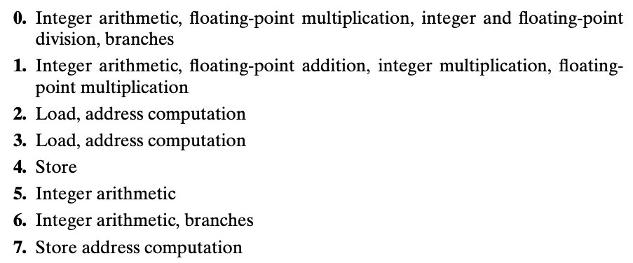
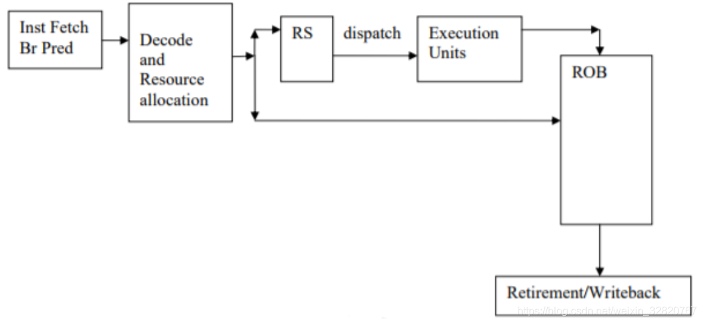

### 5.7.1 Overall operation

随着晶体管集成度越来越高，下一代微处理器有着更多的 functional units 且每个 unit 可以做更多的组合运算，也有着更好的性能。

算术计算单元通常被设计为能胜任多种不同的计算，在不同的程序运行时就都可以达到比较好的性能。

Intel Core i7 functional units: 

现代处理器执行着比程序流所需多很多的指令。称为猜测执行（speculative execution）。指令通过程序执行流的完成来证明其是确实需要的。

在核心的乱序执行流水线，离开退役单元意味着指令是被最后执行，他们的结果在系统结构上而言是正确的可见的，就好像它们按顺序执行一样。如下图：

感觉听着和预写日志也蛮像的：
> any updates to the program registers occur only as instructions are being retired, and this takes place only after the processor can be certain that any branches leading to this instruction have been correctly predicted.

