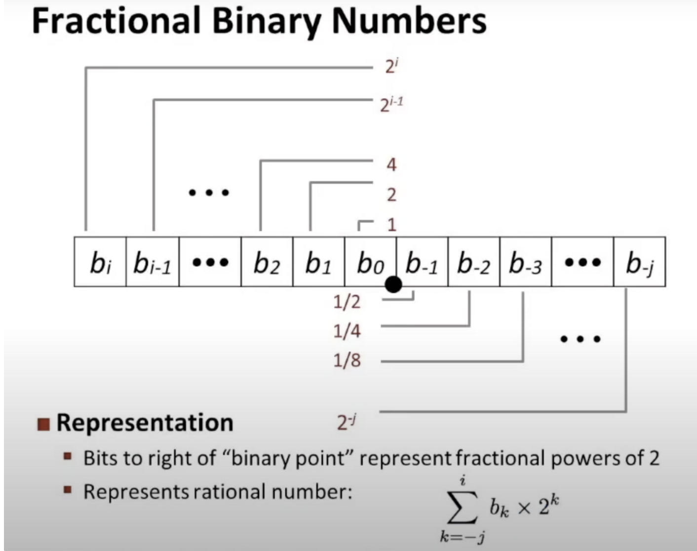
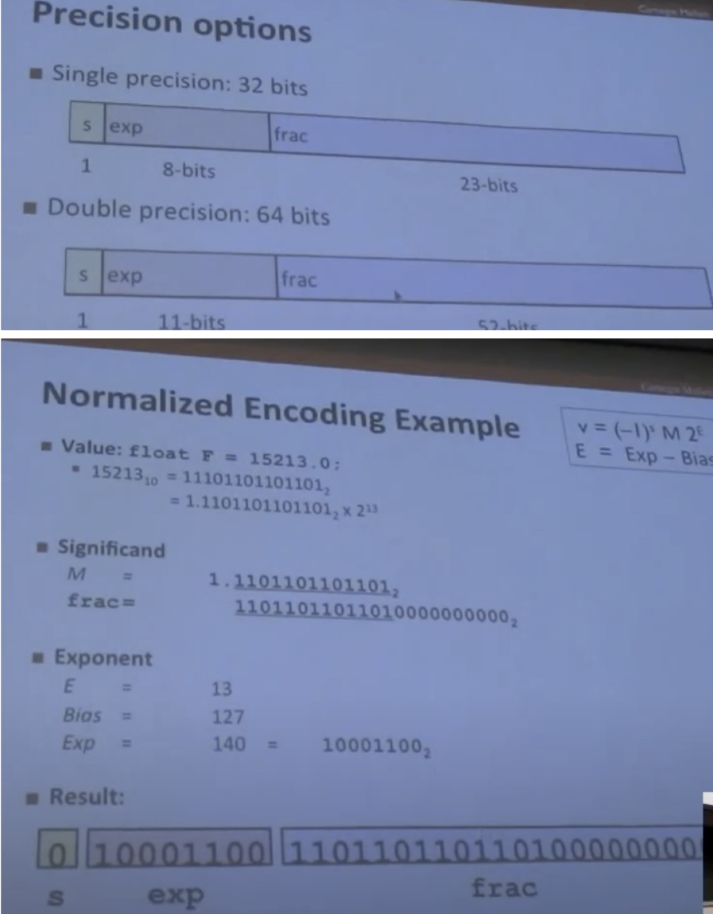

# Floating point

浮点是计算机内部表示实数的方法

2进制小数和10进制的算法是一样的

例子：

5又3/4 ⇒ 101.11(2)

2又7/8 ⇒ 10.111(2)

1又7/16 ⇒ 1.0111(2)

有的数需要用无限循环小数去表示，比如1/3、1/5、1/10

IEEE标准浮点数表示法

$(-1)^sM2^E$

：

$E=Exp-Bias$

$Bias = 2^{k-1}-1$. — float(127) double(1023)

0 ≤ EXP ≤ 255

-127 ≤ E ≤ 128