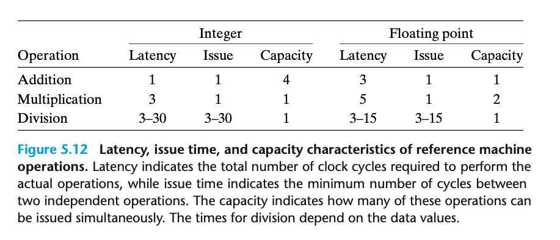

### 5.7.2 Functional Unit Performance

本章内容建立在 Intel Core i7 Haswell 的场景下

capacity 表示多少个操作可以同时进行； issue 表示两个独立操作之间最少的周期； latency 表示整个操作完成的时间。

加法和乘法的 issue time 是 1 得益于 pipeline 技术

> a typical floating- point adder contains three stages (and hence the three-cycle latency): one to process the exponent values, one to add the fractions, and one to round the result.

capacity 多余1 则是因为我们有多足不同的 functional units

对于 division 来说则不能 pipeline；除法性能开销更大

CPU 设计者需要精心平衡不同功能单元的数量，以得到最大的吞吐

