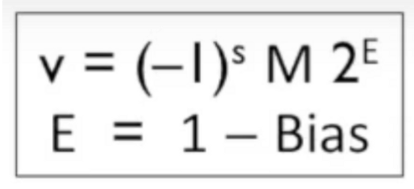
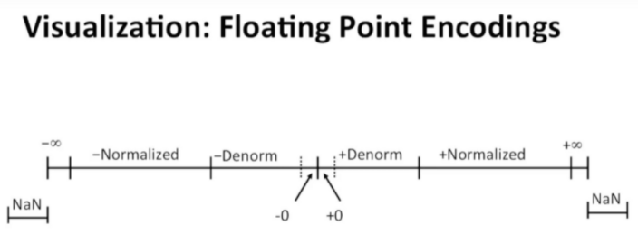
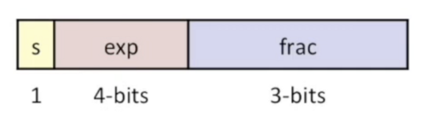
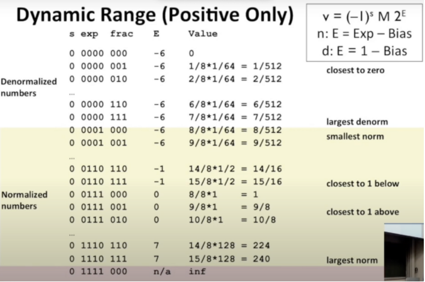

特殊情况：

1.exp=000..0

公式将变成

此时该浮点数将接近于0

2.exp=111..1

- frac=000..0  此时浮点数为infinity，比如浮点数的加法和乘法的溢出会变成这样
- frac≠000..0 此时浮点数为NaN

浮点数表示的范围：

## 举例说明

就像理解二进制补码和unsigned的时候一样，先举一些简单的例子去理解

exp为000时，frac的整数位为0

exp不为000时，frac的整数位为1

