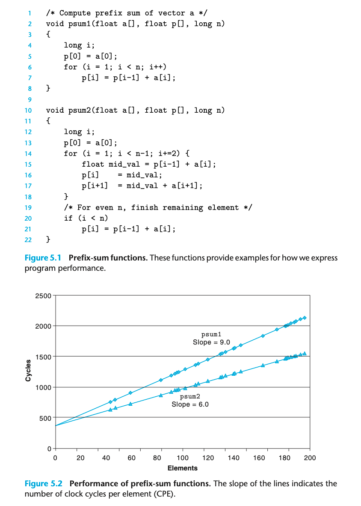

## 5.2 Expressing Program Performance

cycles per element (CPE) 用于衡量程序性能；处理器主频说的就是每秒能计算的cycles

可以帮助我们理解循环的开销细节

其中，psum2 采用了一种叫做 loop unrolling 的技术；会带来一定的性能提升。观察 CPE 可以得到 368 + 9.0n 和 368 + 6.0n。
相比于观察iterations，观察CPE显然是更合理的选择；psum2的iterations当然是显著小于psum1的。

