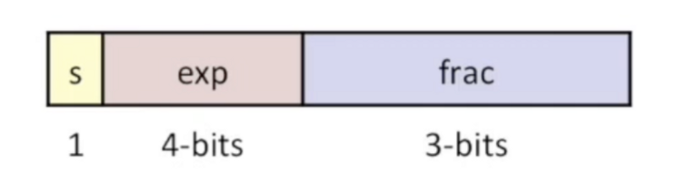
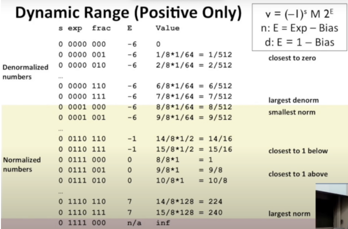
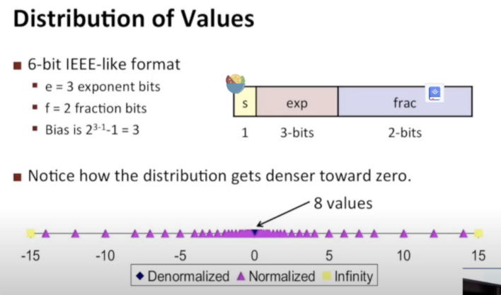
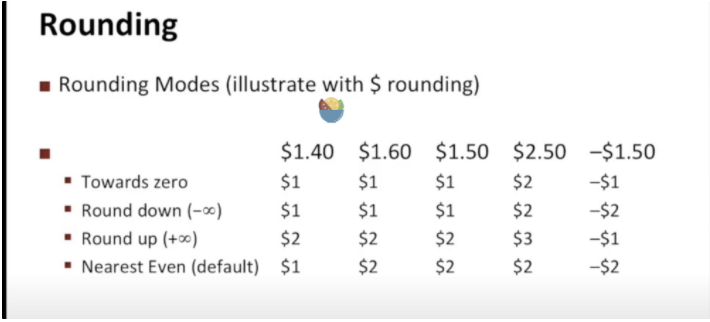

## 举例说明和相关属性

就像理解二进制补码和unsigned的时候一样，先举一些简单的例子去理解

exp为000时，frac的整数位为0

exp不为000时，frac的整数位为1

黄色的是正常值

数的可视化分布

2个特性：

1.所有位为0的时候，等同于整数0

2.可以用无符号去进行比较（unsigned）

浮点数运算：

- 相加：有限的位可能不能够完全表示

类比成乘法，你自己做加法或者乘法，假设你有无限的位，然后进行舍入 得到精确值

- 相乘

IEEE中有4种不同的舍入方式：

默认是最后一种：向偶数舍入，4舍高于5则入

