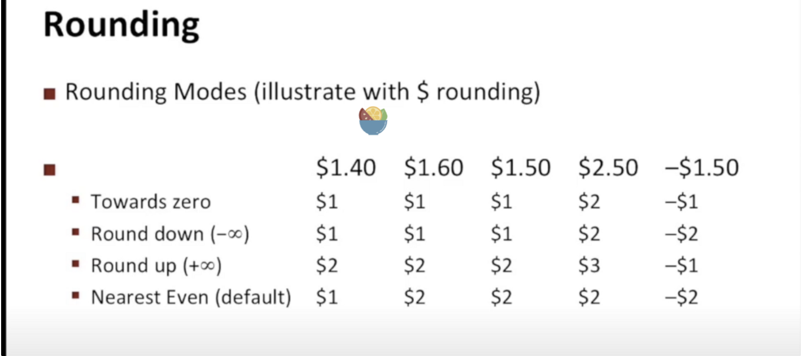
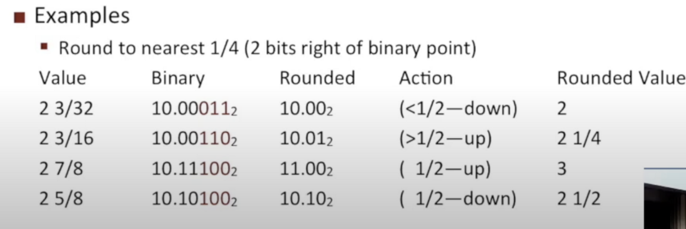
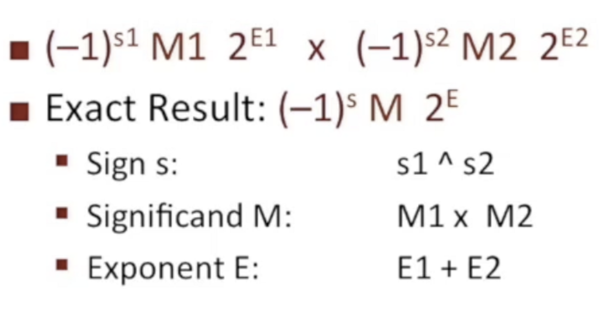
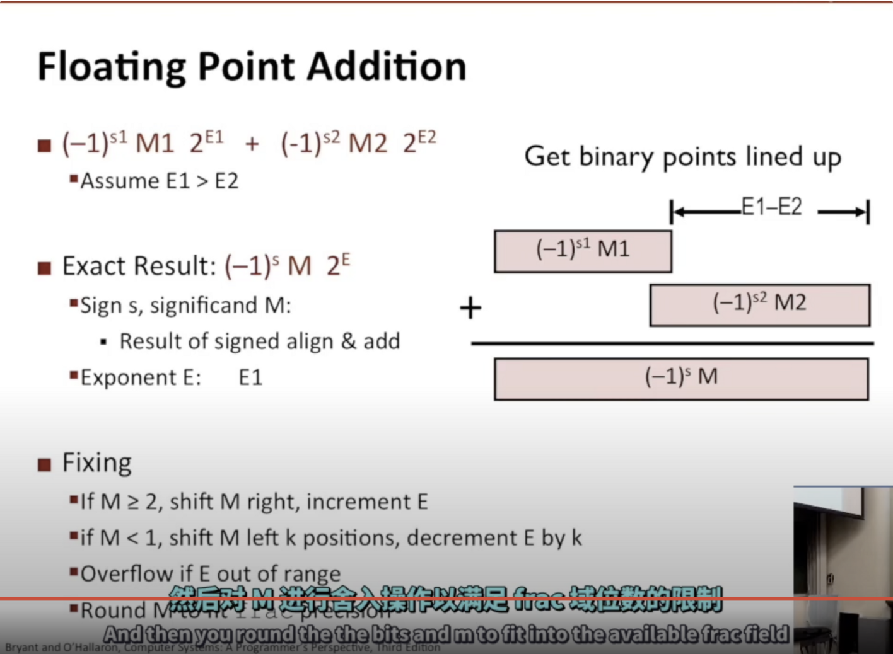
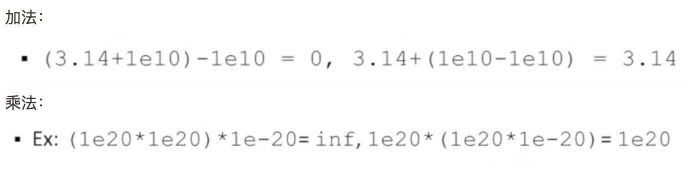
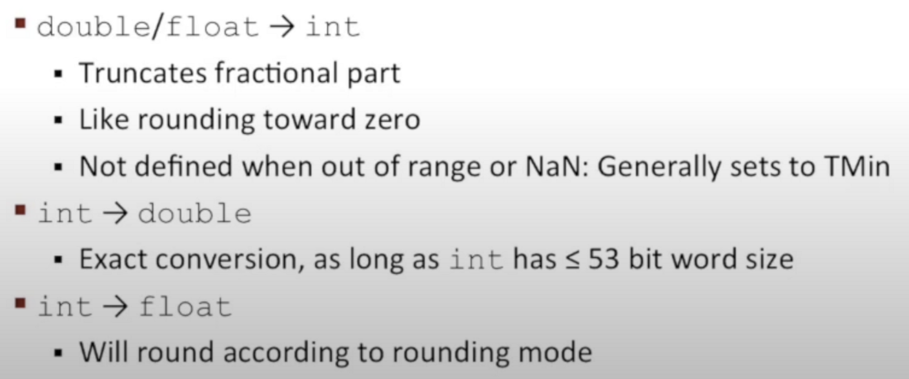

浮点数运算：

- 舍入

类比成乘法，你自己做加法或者乘法，假设你有无限的位，然后进行舍入 得到精确值

IEEE中有4种不同的舍入方式：

默认是最后一种：向偶数舍入，4舍高于5则入

二进制小数的四舍五入

规则：

1.上一位是0则是偶数，1则是奇数

2.100这种就是一半（1/2） 100之后都是大于1/2，比如111，110，101；之前都是小于1/2，比如011，010，001

- 相乘

1.如果M>2，需要进行标准化成1～2的数字，位数太多需要进行舍入处理

2.如果E溢出，将会变成无穷大

- 加法（看不懂）

浮点数的加法和乘法不一定满足结合性

## C语言的浮点数

浮点数有单精度（float）和双精度（double）2种

float、double、int之间的转换

浮点数到整数的类型转换，将改变数的值：

去掉小数部分，保留整数部分

## 课后练习

int x = ..

float f = ..

double d = ..

- x == (int)(float) x

  false,位可能不够放，会丢失一些位的值

- x == (int)(double)x

  true

- f == (float)(double)f

  true

- d == (double)(float)d

  false

- f==-(-f)

  true

- 2/3 == 2/3.0

  false,前者是0

- d<0.0 ⇒ ((d*2)<0.0)

  true

- d > f ⇒ -f>-d

  true

- d*d ≥ 0.0

  true

- (d+f)-d == f

  false，不满足结合律，有可能精度丢失