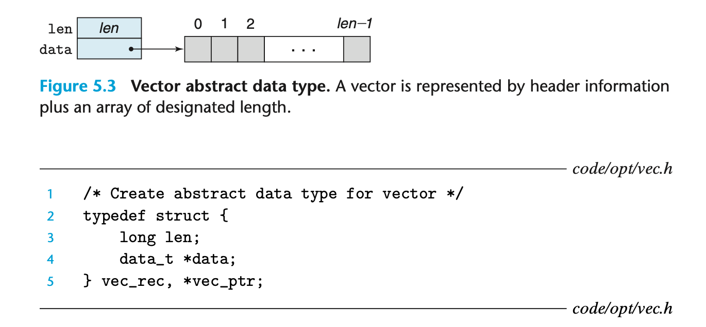
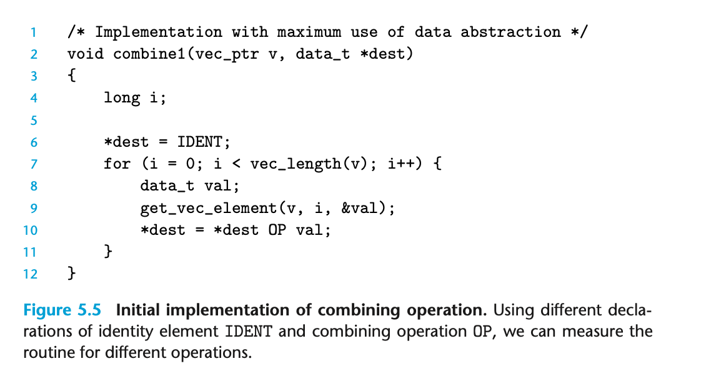

## 5.3 Program Example

To demonstrate how an abstract program can be systematically transformed into more efficient code, we will use a running example based on the vector data structure shown in Figure 5.3. 

