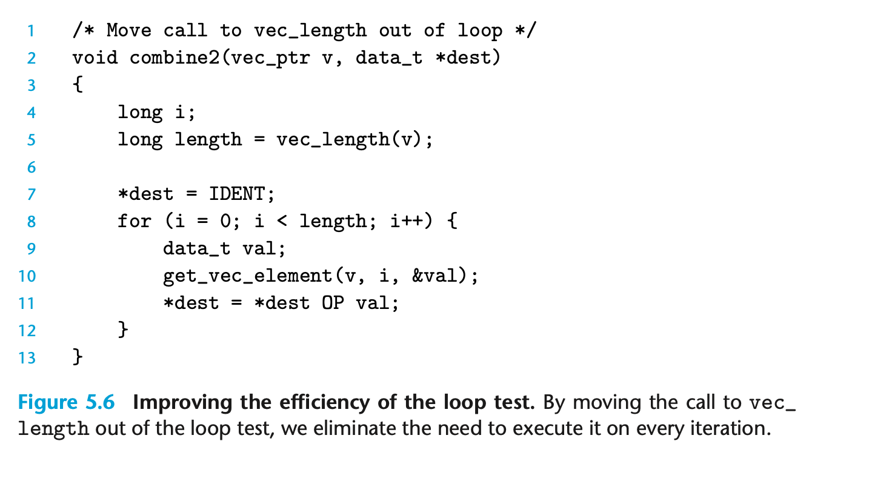
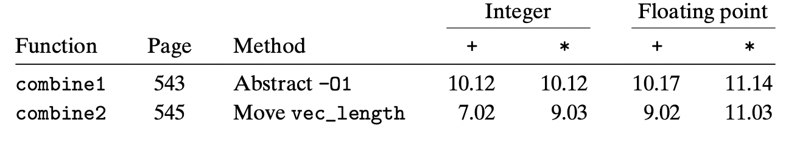
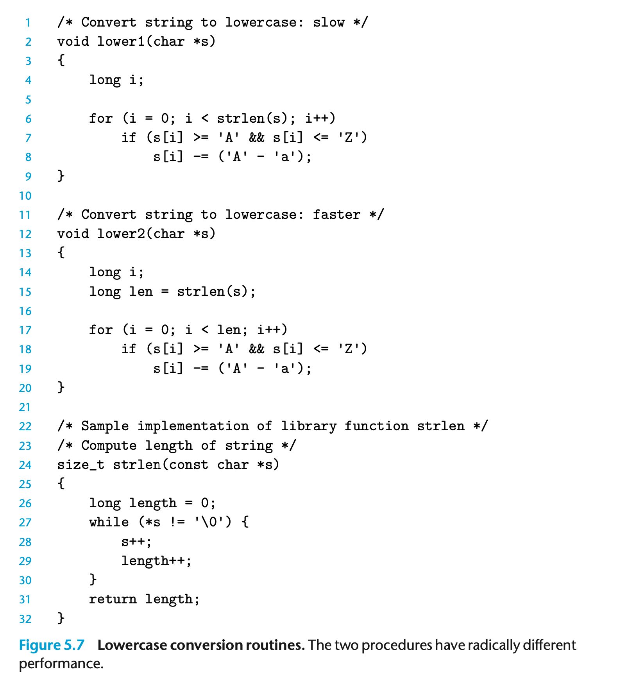
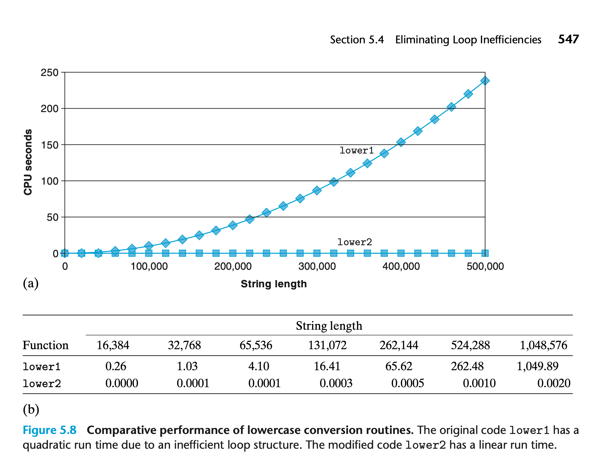

## 5.4 Eliminating Loop Inefficiencies

在循环中，condition每次都会被求值。但在我们的例子里，vector length 实际上是不变的；我们可以减少这样的开销。

可见这样修改（将length存到变量里）就可以获得一定的性能提升。

但是编译器无法容易的确定类似 `vec_length` 这样的函数是否有副作用；因此这样的 code motion 优化，需要程序员的辅助。

这样的代码性能差异就更大一些。 O(N) vs O(N^2)

在代码中 s[i] 会被修改，编译器无法确认是否有 0 -> 1 或者 1 -> 0 的变化，所以相关的优化必须人们自己来做。