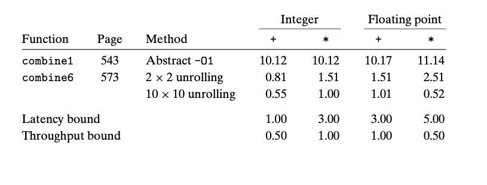

## 5.10 Summary of Results for Optimizing Combining Code

通过前述技巧，我们最终可以获得明显的性能提升；下面是在我们并没有使用向量化AVX技术就可以获得的性能提升。

现在代码基本上仅受限于 functional units 的容量；可以提高10到20倍；如果再加上向量化技术，可以额外提高4到8倍，加起来最多可能可以提高甚至180倍的性能。