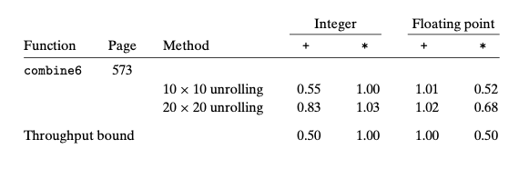

## 5.11 some limiting factors
critical path 通常决定了程序运行时间的下届（至少要这么多时间）
还有一些数据链的依赖会导致整体运行时间变长

> a program requires a total of N computations of some operation, the microprocessor has C functional units capable of performing that operation, and that these units have an issue time of I. Then the program will require at least N * I/C cycles to execute.


### 5.11.1 register spilling
> benefits of loop parallelism are limited by the ability to express the compu- tation in assembly code.

如果并行度 P 超过了可用寄存器数量；编译器就回进行 spilling； 通常是在 run-time stack 内存中存储一些临时值

> the following measurements compare the result of extending the multiple accumulator scheme of combine6 to the cases of k = 10 and k = 20:



CPE并没有提升，有时候会变得更差

```
Updating of accumulator acc0 in 10 x 10 urolling 
vmulsd (%rdx), %xmm0, %xmm0 #acc0 *= data[i]
```

```
  Updating of accumulator acc0 in 20 x 20 unrolling
  vmovsd  40(%rsp), %xmm0
  vmulsd  (%rdx), %xmm0, %xmm0
  vmovsd  %xmm0, 40(%rsp)
```

20x20 需要将数据从内存中（data[i]）读出，然后再写回 offset 40 的栈上，所以性能并不会提升。