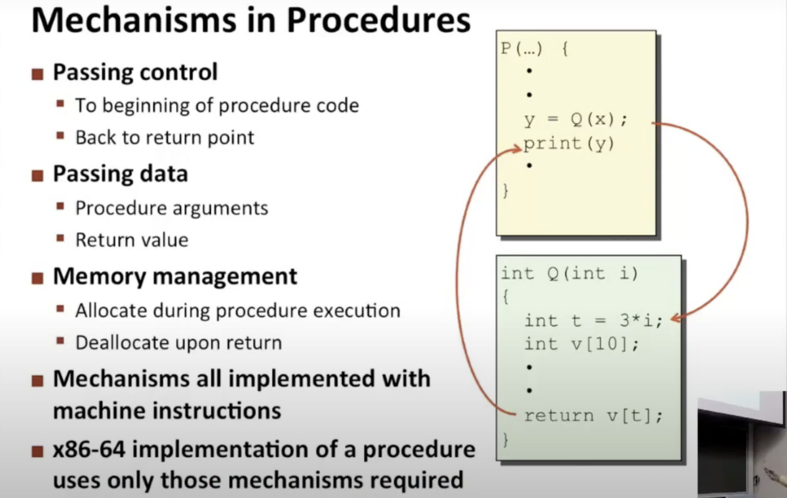
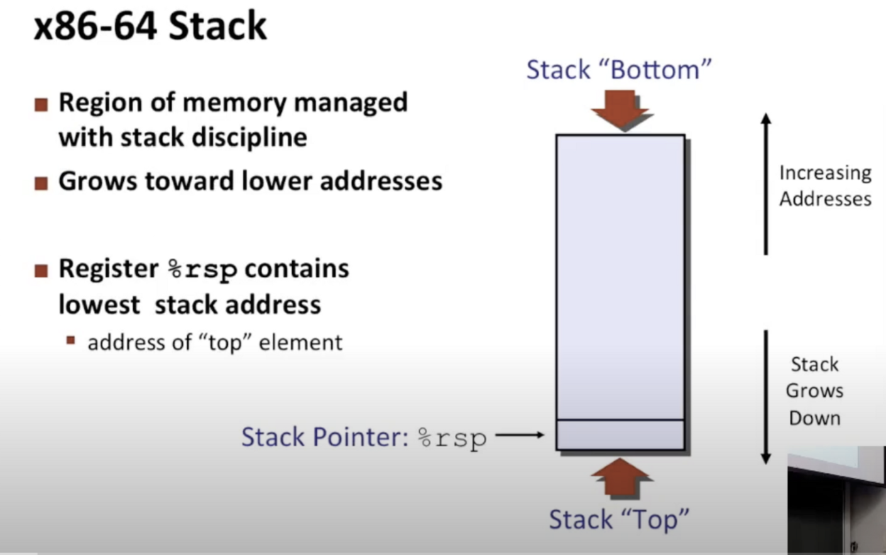
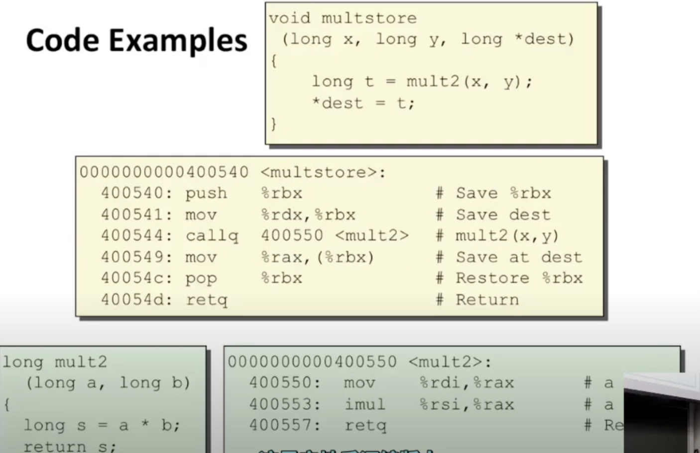

1.控制

我们需要将控制权转移给另一个函数并确保它能返回到正确的位置

2.数据

如何传递数据，回传数据

3.内存管理

如何控制局部数据在函数执行完毕后释放空间

栈

对于汇编层面的程序员来说，内存只是一个巨大的字节数组，在那堆字节中的某个地方，我们将其称为栈

程序利用栈来管理过程调用与返回的状态

开始的地址实际上是一个编号非常高的地址，当栈生长时，更多的数据分配给栈，这是通过递减栈指针来完成的，所以栈指针只是一个常规的寄存器&rsp，它的值时当前栈顶部的地址

操作：push和pop

cal和ret指令

