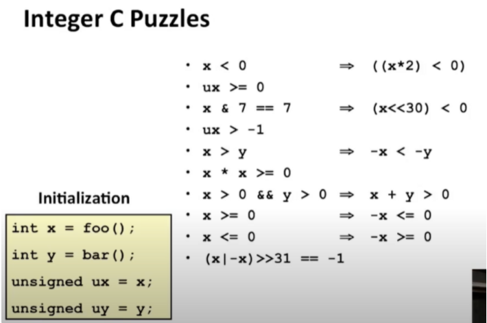

## 随堂检测

1.false 左移溢出 符号位由1变0

2.true

3.true

4.false 无符号和有符号一起出现，会自动转换成无符号，-1是最大

5.false y是TMIN的时候，取负值溢出

6.false 溢出有可能是负值

7.false 溢出有可能是负值

8.true 正数都有对应的负数

9.false  TMIN没有对应的正数

10.false 取0

## 总结

1.有符号和无符号数总结

C语言有无符号整数的说法，python和Java没有

默认是有符号的

声明无符号number的方式为加上后缀U，如`12345U`

有符号数和无符号数的区别是：有符号数的第一位是符号位

TMAX、TMIN、UMAX之间关系

显式转换：(unsigned)-1

隐式转换：当无符号和有符号在一个表达式中，有符号自动转成无符号

2.运算总结

加法和乘法都会overlfow

加法：

无符号数溢出进位超出的去掉

有符号数其实也是，但是注意这里可能造成负负得正或者正正得负

乘法：

w位相乘最多可能需要2w位去存储

如果最多只能w位，那么超出也是直接去掉

这样就有可能会出现：乘法得出负数的情况

除以2的幂（补位操作）

对数作位移操作，然后进行补位

正数的补位补0，负数的补位补1

取反

各个bit相反，然后+1

0110(6) ⇒ 1001 + 0001 ⇒ 1010(-6)

3.字长和字节顺序

xx位指的是字长，也叫机器字长，是CPU中寄存器的位数

64位通常处理64位值和算术运算，他的指针和地址的值也是64位

字节在字中的顺序分为小端序和大端序

小端序：第一个字节是最低有效字节

大端序：和小端序相反