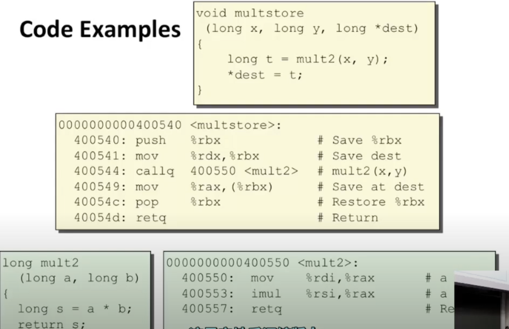
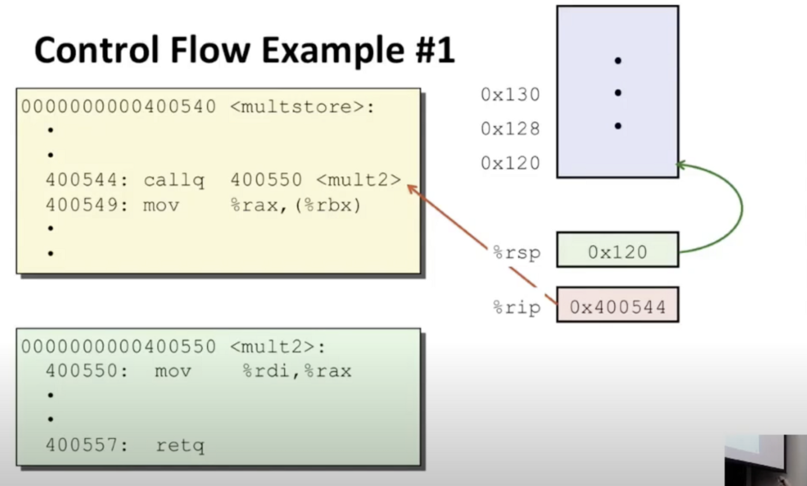
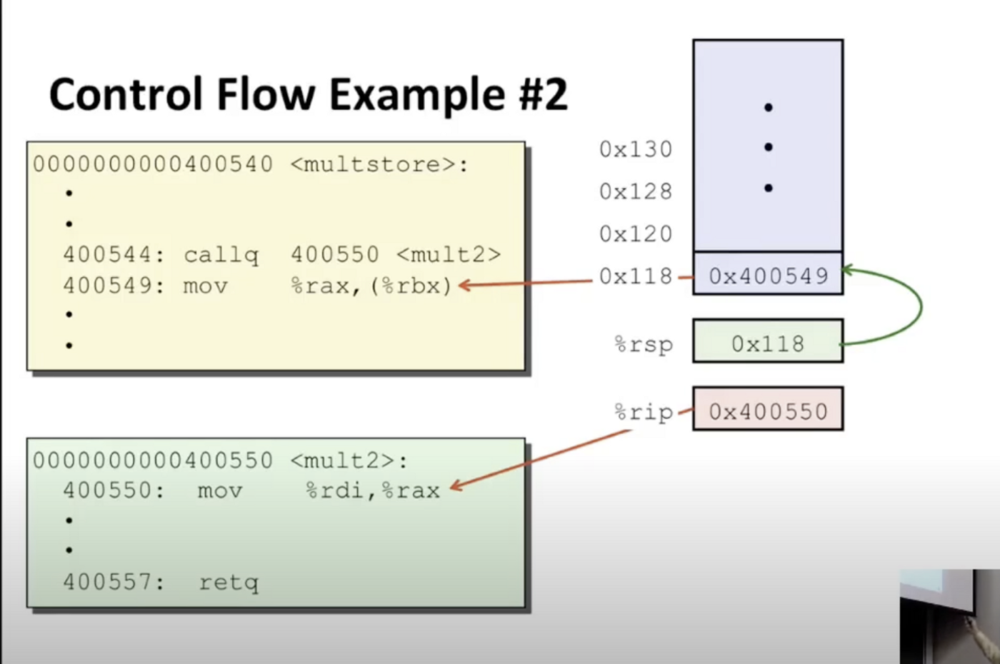
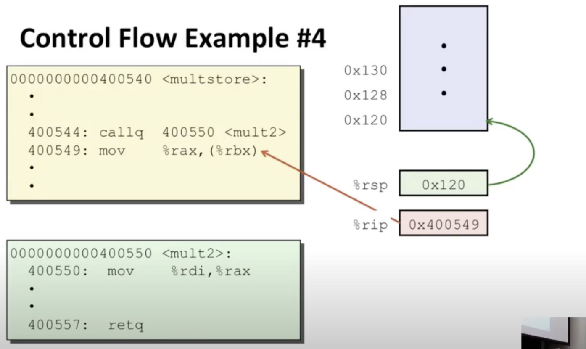

cal和ret指令

call：调用函数

ret：准备好返回的时候，调用ret指令

%rsp：栈顶部

%rip：当前执行的指令地址

初始状态：一开始%rsp指向的是0x120

执行call会做3件事：

1.减少栈指针，从0x120编程0x118

2.将此调用之后的指令地址写入栈顶部

3.修改%rip为当前执行的指令地址

ret做了：

1.增加栈指针，回到原来的地方

2.修改%rip为新的指令地址

