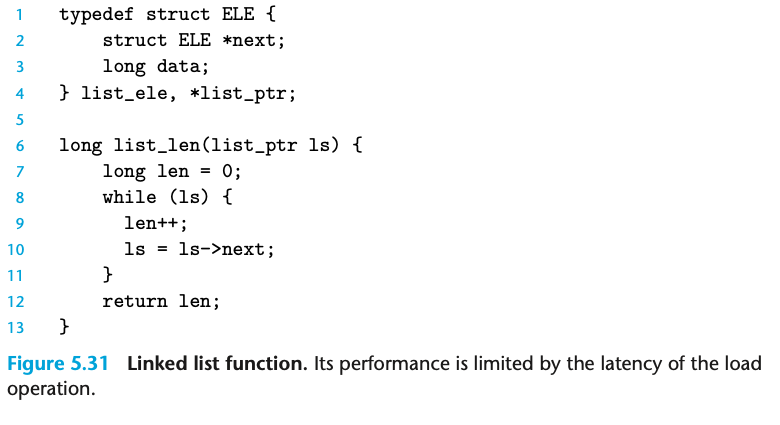
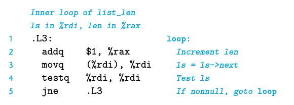

- 之前的例子没有太体现出 load operation 造成的延迟；之前通过loop index访问的数组并不是性能的瓶颈  
- 举一个链表的例子来  
-   
- 我们的测试显示 list_len 的 CPE 是 4； 这是直接由 load latency 导致的  
-   
- movq 是现在主要的瓶颈；由于每个后继地址都需要先得到前面的节点，所以每一个循环都需要在前面的循环结束之后才能开始；而CPE=4主要就是由latency造成的，L1 cache的访问时间差不多就需要4个周期  